# Sơ Đồ Thiết Kế Database - Hệ Thống Chatbot Workflow

## ERD (Entity Relationship Diagram) - Chi Tiết

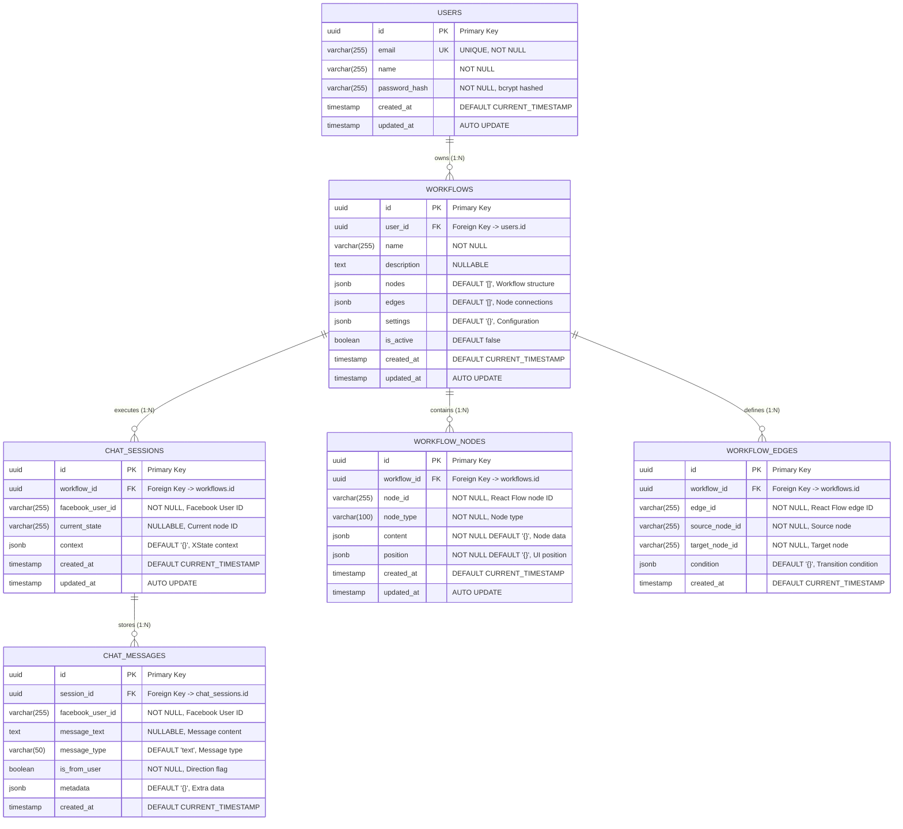

## Detailed Relationship Visualization

```mermaid
graph TD
    subgraph "USER DOMAIN"
        U[👤 USERS<br/>- id: UUID 🔑<br/>- email: varchar(255) 🔒<br/>- name: varchar(255)<br/>- password_hash: varchar(255)<br/>- created_at/updated_at]
    end
    
    subgraph "WORKFLOW DOMAIN"
        W[⚙️ WORKFLOWS<br/>- id: UUID 🔑<br/>- user_id: UUID 🔗<br/>- name: varchar(255)<br/>- description: text<br/>- nodes: JSONB 📊<br/>- edges: JSONB 🔗<br/>- settings: JSONB ⚙️<br/>- is_active: boolean<br/>- created_at/updated_at]
        
        WN[📦 WORKFLOW_NODES<br/>- id: UUID 🔑<br/>- workflow_id: UUID 🔗<br/>- node_id: varchar(255)<br/>- node_type: varchar(100)<br/>- content: JSONB 📄<br/>- position: JSONB 📍<br/>- created_at/updated_at]
        
        WE[🔗 WORKFLOW_EDGES<br/>- id: UUID 🔑<br/>- workflow_id: UUID 🔗<br/>- edge_id: varchar(255)<br/>- source_node_id: varchar(255)<br/>- target_node_id: varchar(255)<br/>- condition: JSONB ⚡<br/>- created_at]
    end
    
    subgraph "CHAT DOMAIN"
        CS[💬 CHAT_SESSIONS<br/>- id: UUID 🔑<br/>- workflow_id: UUID 🔗<br/>- facebook_user_id: varchar(255)<br/>- current_state: varchar(255)<br/>- context: JSONB 🧠<br/>- created_at/updated_at]
        
        CM[📨 CHAT_MESSAGES<br/>- id: UUID 🔑<br/>- session_id: UUID 🔗<br/>- facebook_user_id: varchar(255)<br/>- message_text: text<br/>- message_type: varchar(50)<br/>- is_from_user: boolean<br/>- metadata: JSONB 📋<br/>- created_at]
    end
    
    %% Relationships with labels
    U -->|"1:N<br/>owns"| W
    W -->|"1:N<br/>contains"| WN
    W -->|"1:N<br/>defines"| WE
    W -->|"1:N<br/>executes"| CS
    CS -->|"1:N<br/>stores"| CM
    
    %% Styling
    classDef userDomain fill:#e1f5fe,stroke:#01579b,stroke-width:2px
    classDef workflowDomain fill:#f3e5f5,stroke:#4a148c,stroke-width:2px
    classDef chatDomain fill:#e8f5e8,stroke:#1b5e20,stroke-width:2px
    
    class U userDomain
    class W,WN,WE workflowDomain
    class CS,CM chatDomain
```

## Foreign Key Constraints & Cascading

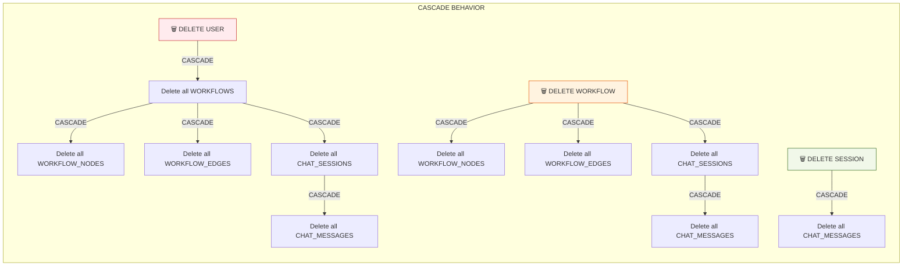

## Index Strategy Visualization

```mermaid
graph TB
    subgraph "🚀 PERFORMANCE INDEXES"
        I1[📇 idx_workflows_user_id<br/>ON workflows(user_id)<br/>🎯 Find user's workflows]
        I2[📇 idx_chat_sessions_workflow_id<br/>ON chat_sessions(workflow_id)<br/>🎯 Find workflow sessions]
        I3[📇 idx_chat_sessions_facebook_user_id<br/>ON chat_sessions(facebook_user_id)<br/>🎯 Find user sessions]
        I4[📇 idx_chat_messages_session_id<br/>ON chat_messages(session_id)<br/>🎯 Get chat history]
        I5[📇 idx_workflow_nodes_workflow_id<br/>ON workflow_nodes(workflow_id)<br/>🎯 Load workflow structure]
        I6[📇 idx_workflow_edges_workflow_id<br/>ON workflow_edges(workflow_id)<br/>🎯 Load workflow connections]
    end
    
    subgraph "🎯 QUERY PATTERNS"
        Q1[Find workflows by user]
        Q2[Load workflow for execution]
        Q3[Get user's active session]
        Q4[Retrieve chat history]
        Q5[Build workflow graph]
    end
    
    Q1 -.-> I1
    Q2 -.-> I2
    Q2 -.-> I5
    Q2 -.-> I6
    Q3 -.-> I3
    Q4 -.-> I4
    Q5 -.-> I5
    Q5 -.-> I6
```

## JSONB Structure Details

### Workflow Nodes JSONB Schema
```mermaid
graph TD
    subgraph "WORKFLOWS.nodes JSONB"
        WN[📦 WorkflowNode Array]
        WN --> WN1[🆔 id: string]
        WN --> WN2[🏷️ type: string]
        WN --> WN3[📍 position: {x, y}]
        WN --> WN4[📄 data: NodeData]
        
        WN4 --> WD1[🏷️ label: string]
        WN4 --> WD2[💬 message?: string]
        WN4 --> WD3[📋 elements?: Element[]]
        WN4 --> WD4[🔘 buttons?: Button[]]
        WN4 --> WD5[⚡ quickReplies?: QuickReply[]]
        
        WD3 --> E1[📝 text/image/video]
        WD3 --> E2[🔘 button/quick_reply]
        WD3 --> E3[🃏 generic_card]
    end
    
    subgraph "WORKFLOWS.edges JSONB"
        WE[🔗 WorkflowEdge Array]
        WE --> WE1[🆔 id: string]
        WE --> WE2[➡️ source: string]
        WE --> WE3[⬅️ target: string]
        WE --> WE4[🔌 sourceHandle?: string]
        WE --> WE5[🔌 targetHandle?: string]
    end
```

### Chat Context JSONB Schema
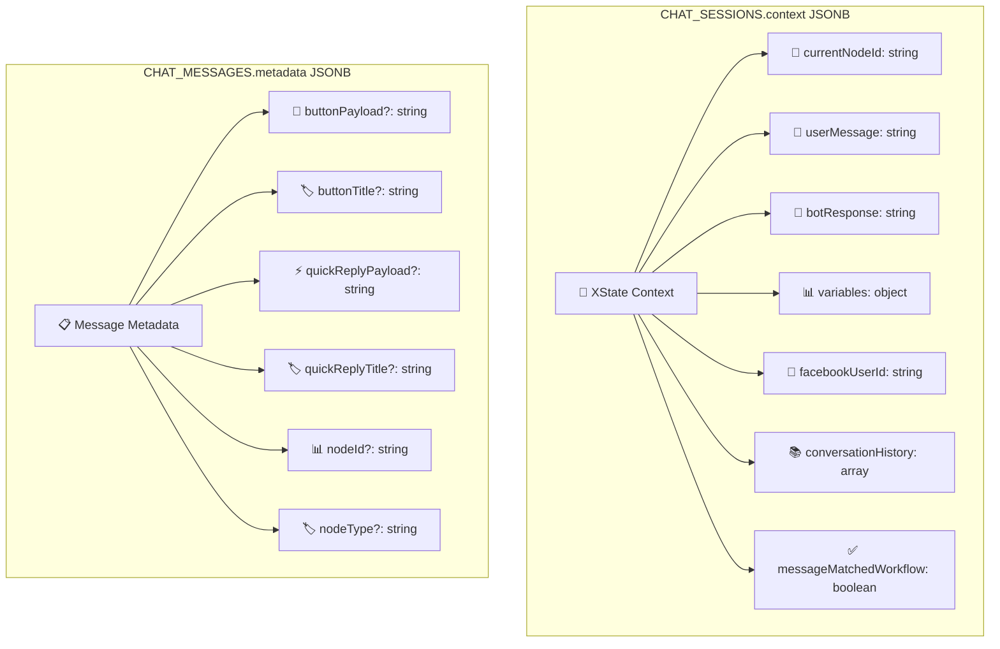

## Database Size Estimation

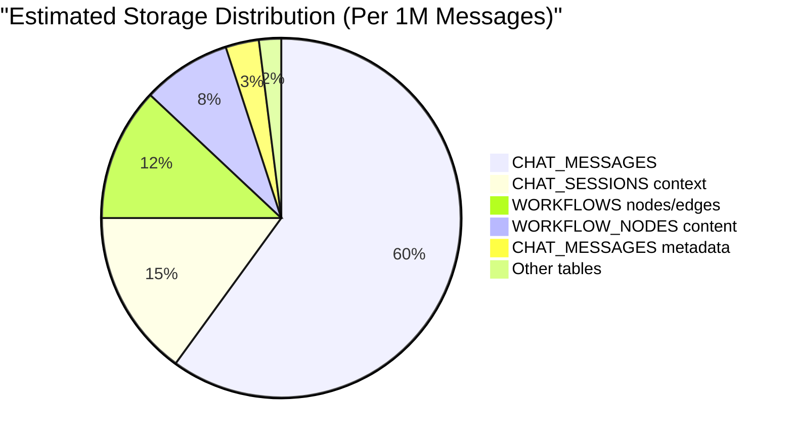

## Query Performance Metrics

```mermaid
gantt
    title Database Query Performance (Average Response Time)
    dateFormat X
    axisFormat %s ms
    
    section Read Queries
    Get User Workflows    :1, 5
    Load Workflow Structure :2, 8
    Find User Session     :1, 3
    Get Chat History      :5, 15
    Load Node Content     :3, 7
    
    section Write Queries
    Save Message          :8, 12
    Create Session        :10, 15
    Update Session State  :5, 8
    Create Workflow       :15, 25
    
    section Complex Queries
    Workflow Execution    :20, 35
    Message Matching      :12, 20
    Context Update        :8, 15
```

## Database Schema Evolution

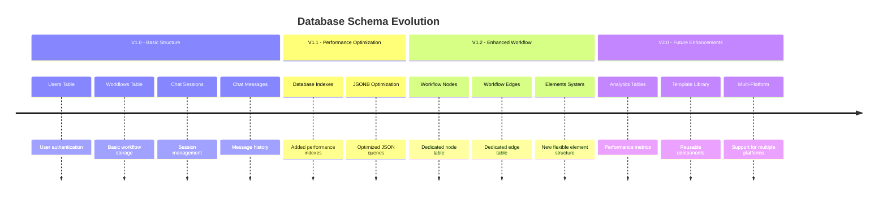

## Data Flow Trong Database

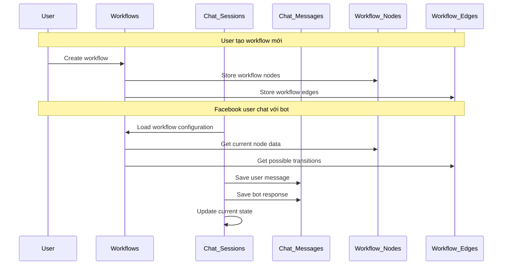

## Storage Optimization

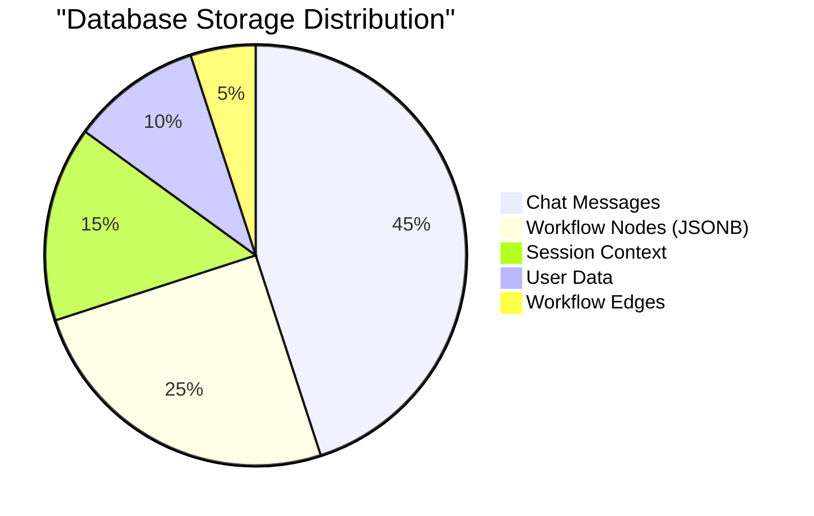

## Query Performance Analysis

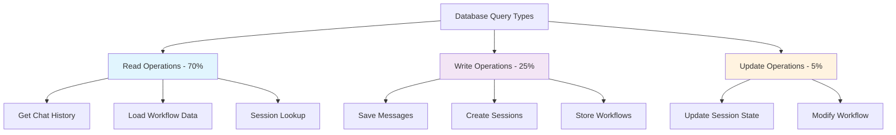

## Backup và Recovery Strategy

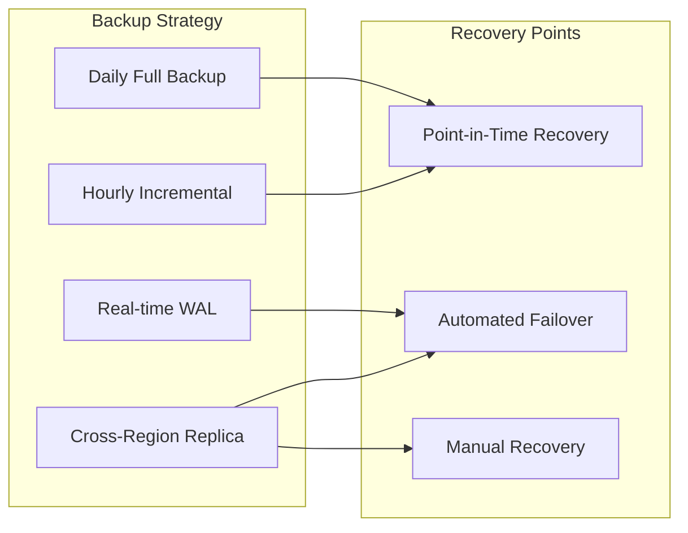

## Database Scaling Plan

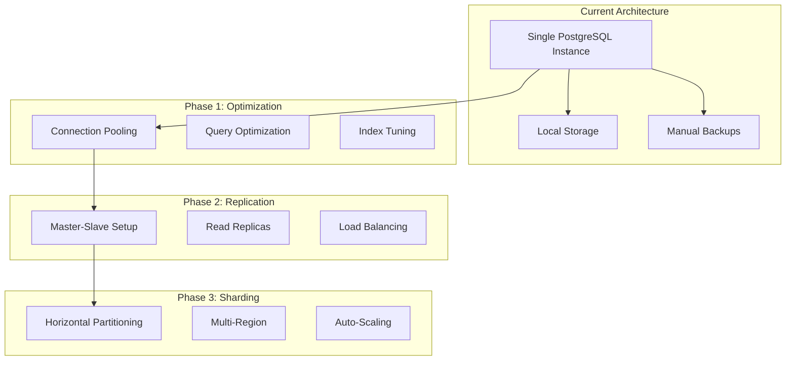