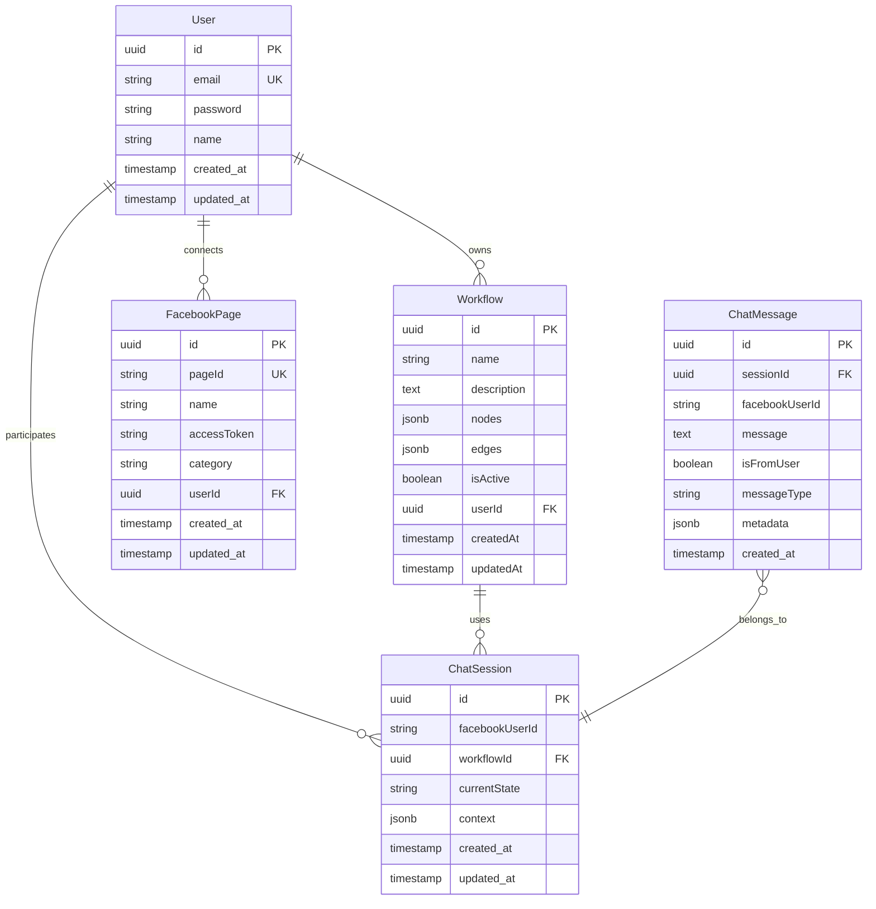

# Database Schema Documentation

## 📊 **Tổng quan Database**

Hệ thống sử dụng **PostgreSQL** làm database chính với **TypeORM** làm ORM. Database được thiết kế để hỗ trợ:
- Multi-user workflow management
- Chat session tracking
- Facebook integration
- User authentication

---

## 🗃️ **Database Schema Overview**



---

## 📋 **Entity Definitions**

### 1. **User Entity**

**Table**: `users`

```sql
CREATE TABLE users (
    id UUID PRIMARY KEY DEFAULT gen_random_uuid(),
    email VARCHAR(255) UNIQUE NOT NULL,
    password VARCHAR(255) NOT NULL,
    name VARCHAR(255) NOT NULL,
    created_at TIMESTAMP DEFAULT CURRENT_TIMESTAMP,
    updated_at TIMESTAMP DEFAULT CURRENT_TIMESTAMP
);

-- Indexes
CREATE INDEX idx_users_email ON users(email);
CREATE INDEX idx_users_created_at ON users(created_at);
```

**TypeORM Entity**:
```typescript
@Entity('users')
export class User {
  @PrimaryGeneratedColumn('uuid')
  id: string;

  @Column({ unique: true })
  email: string;

  @Column()
  password: string;

  @Column()
  name: string;

  @CreateDateColumn()
  created_at: Date;

  @UpdateDateColumn()
  updated_at: Date;

  // Virtual fields
  @OneToMany(() => Workflow, workflow => workflow.user)
  workflows: Workflow[];

  @OneToMany(() => FacebookPage, page => page.user)
  facebookPages: FacebookPage[];

  @OneToMany(() => ChatSession, session => session.user)
  chatSessions: ChatSession[];
}
```

**Constraints**:
- `email` phải unique
- `password` được hash với bcrypt
- `name` không được null

---

### 2. **Workflow Entity**

**Table**: `workflows`

```sql
CREATE TABLE workflows (
    id UUID PRIMARY KEY DEFAULT gen_random_uuid(),
    name VARCHAR(255) NOT NULL,
    description TEXT,
    nodes JSONB NOT NULL DEFAULT '[]',
    edges JSONB NOT NULL DEFAULT '[]',
    "isActive" BOOLEAN DEFAULT FALSE,
    "userId" UUID NOT NULL,
    "createdAt" TIMESTAMP DEFAULT CURRENT_TIMESTAMP,
    "updatedAt" TIMESTAMP DEFAULT CURRENT_TIMESTAMP,
    
    CONSTRAINT fk_workflow_user 
        FOREIGN KEY ("userId") REFERENCES users(id) 
        ON DELETE CASCADE
);

-- Indexes
CREATE INDEX idx_workflows_user_id ON workflows("userId");
CREATE INDEX idx_workflows_active ON workflows("isActive");
CREATE INDEX idx_workflows_created_at ON workflows("createdAt");

-- Only one active workflow per user
CREATE UNIQUE INDEX idx_workflows_user_active 
    ON workflows("userId") 
    WHERE "isActive" = TRUE;
```

**TypeORM Entity**:
```typescript
@Entity('workflows')
export class Workflow {
  @PrimaryGeneratedColumn('uuid')
  id: string;

  @Column()
  name: string;

  @Column({ type: 'text', nullable: true })
  description: string;

  @Column({ type: 'jsonb', default: [] })
  nodes: WorkflowNode[];

  @Column({ type: 'jsonb', default: [] })
  edges: WorkflowEdge[];

  @Column({ default: false })
  isActive: boolean;

  @ManyToOne(() => User, user => user.workflows, { onDelete: 'CASCADE' })
  user: User;

  @Column()
  userId: string;

  @CreateDateColumn()
  createdAt: Date;

  @UpdateDateColumn()
  updatedAt: Date;
}
```

**Node Structure**:
```typescript
interface WorkflowNode {
  id: string;
  type: string;
  position: { x: number; y: number };
  data: {
    label: string;
    message?: string;
    messageType?: string;
    elements?: WorkflowElement[];
    buttons?: Button[];
    quickReplies?: QuickReply[];
    // ... other properties
  };
}
```

**Edge Structure**:
```typescript
interface WorkflowEdge {
  id: string;
  source: string;
  target: string;
  sourceHandle?: string;
  targetHandle?: string;
  type?: string;
}
```

---

### 3. **Facebook Page Entity**

**Table**: `facebook_pages`

```sql
CREATE TABLE facebook_pages (
    id UUID PRIMARY KEY DEFAULT gen_random_uuid(),
    "pageId" VARCHAR(255) UNIQUE NOT NULL,
    name VARCHAR(255) NOT NULL,
    "accessToken" TEXT NOT NULL,
    category VARCHAR(255),
    "userId" UUID NOT NULL,
    created_at TIMESTAMP DEFAULT CURRENT_TIMESTAMP,
    updated_at TIMESTAMP DEFAULT CURRENT_TIMESTAMP,
    
    CONSTRAINT fk_facebook_page_user 
        FOREIGN KEY ("userId") REFERENCES users(id) 
        ON DELETE CASCADE
);

-- Indexes
CREATE INDEX idx_facebook_pages_user_id ON facebook_pages("userId");
CREATE INDEX idx_facebook_pages_page_id ON facebook_pages("pageId");
```

**TypeORM Entity**:
```typescript
@Entity('facebook_pages')
export class FacebookPage {
  @PrimaryGeneratedColumn('uuid')
  id: string;

  @Column({ unique: true })
  pageId: string;

  @Column()
  name: string;

  @Column({ type: 'text' })
  accessToken: string;

  @Column({ nullable: true })
  category: string;

  @ManyToOne(() => User, user => user.facebookPages, { onDelete: 'CASCADE' })
  user: User;

  @Column()
  userId: string;

  @CreateDateColumn()
  created_at: Date;

  @UpdateDateColumn()
  updated_at: Date;
}
```

---

### 4. **Chat Session Entity**

**Table**: `chat_sessions`

```sql
CREATE TABLE chat_sessions (
    id UUID PRIMARY KEY DEFAULT gen_random_uuid(),
    "facebookUserId" VARCHAR(255) NOT NULL,
    "workflowId" UUID NOT NULL,
    "currentState" VARCHAR(255) NOT NULL,
    context JSONB DEFAULT '{}',
    "userId" UUID NOT NULL,
    created_at TIMESTAMP DEFAULT CURRENT_TIMESTAMP,
    updated_at TIMESTAMP DEFAULT CURRENT_TIMESTAMP,
    
    CONSTRAINT fk_chat_session_workflow 
        FOREIGN KEY ("workflowId") REFERENCES workflows(id) 
        ON DELETE CASCADE,
    CONSTRAINT fk_chat_session_user 
        FOREIGN KEY ("userId") REFERENCES users(id) 
        ON DELETE CASCADE
);

-- Indexes
CREATE INDEX idx_chat_sessions_facebook_user ON chat_sessions("facebookUserId");
CREATE INDEX idx_chat_sessions_workflow ON chat_sessions("workflowId");
CREATE INDEX idx_chat_sessions_user ON chat_sessions("userId");

-- Unique session per Facebook user per workflow
CREATE UNIQUE INDEX idx_chat_sessions_unique 
    ON chat_sessions("facebookUserId", "workflowId");
```

**TypeORM Entity**:
```typescript
@Entity('chat_sessions')
export class ChatSession {
  @PrimaryGeneratedColumn('uuid')
  id: string;

  @Column()
  facebookUserId: string;

  @Column()
  workflowId: string;

  @Column()
  currentState: string;

  @Column({ type: 'jsonb', default: {} })
  context: Record<string, any>;

  @ManyToOne(() => User, user => user.chatSessions, { onDelete: 'CASCADE' })
  user: User;

  @Column()
  userId: string;

  @ManyToOne(() => Workflow, { onDelete: 'CASCADE' })
  @JoinColumn({ name: 'workflowId' })
  workflow: Workflow;

  @CreateDateColumn()
  created_at: Date;

  @UpdateDateColumn()
  updated_at: Date;

  @OneToMany(() => ChatMessage, message => message.session)
  messages: ChatMessage[];
}
```

---

### 5. **Chat Message Entity**

**Table**: `chat_messages`

```sql
CREATE TABLE chat_messages (
    id UUID PRIMARY KEY DEFAULT gen_random_uuid(),
    "sessionId" UUID NOT NULL,
    "facebookUserId" VARCHAR(255) NOT NULL,
    message TEXT NOT NULL,
    "isFromUser" BOOLEAN NOT NULL,
    "messageType" VARCHAR(100) DEFAULT 'text',
    metadata JSONB DEFAULT '{}',
    created_at TIMESTAMP DEFAULT CURRENT_TIMESTAMP,
    
    CONSTRAINT fk_chat_message_session 
        FOREIGN KEY ("sessionId") REFERENCES chat_sessions(id) 
        ON DELETE CASCADE
);

-- Indexes
CREATE INDEX idx_chat_messages_session ON chat_messages("sessionId");
CREATE INDEX idx_chat_messages_facebook_user ON chat_messages("facebookUserId");
CREATE INDEX idx_chat_messages_created_at ON chat_messages(created_at);
CREATE INDEX idx_chat_messages_type ON chat_messages("messageType");
```

**TypeORM Entity**:
```typescript
@Entity('chat_messages')
export class ChatMessage {
  @PrimaryGeneratedColumn('uuid')
  id: string;

  @Column()
  sessionId: string;

  @Column()
  facebookUserId: string;

  @Column({ type: 'text' })
  message: string;

  @Column()
  isFromUser: boolean;

  @Column({ default: 'text' })
  messageType: string;

  @Column({ type: 'jsonb', default: {} })
  metadata: Record<string, any>;

  @ManyToOne(() => ChatSession, session => session.messages, { onDelete: 'CASCADE' })
  @JoinColumn({ name: 'sessionId' })
  session: ChatSession;

  @CreateDateColumn()
  created_at: Date;
}
```

---

## 🔧 **Database Migrations**

### **Initial Migration** (`001_create_tables.sql`)

```sql
-- Users table
CREATE EXTENSION IF NOT EXISTS "uuid-ossp";

CREATE TABLE users (
    id UUID PRIMARY KEY DEFAULT uuid_generate_v4(),
    email VARCHAR(255) UNIQUE NOT NULL,
    password VARCHAR(255) NOT NULL,
    name VARCHAR(255) NOT NULL,
    created_at TIMESTAMP DEFAULT CURRENT_TIMESTAMP,
    updated_at TIMESTAMP DEFAULT CURRENT_TIMESTAMP
);

-- Workflows table
CREATE TABLE workflows (
    id UUID PRIMARY KEY DEFAULT uuid_generate_v4(),
    name VARCHAR(255) NOT NULL,
    description TEXT,
    nodes JSONB NOT NULL DEFAULT '[]',
    edges JSONB NOT NULL DEFAULT '[]',
    "isActive" BOOLEAN DEFAULT FALSE,
    "userId" UUID NOT NULL,
    "createdAt" TIMESTAMP DEFAULT CURRENT_TIMESTAMP,
    "updatedAt" TIMESTAMP DEFAULT CURRENT_TIMESTAMP,
    
    CONSTRAINT fk_workflow_user 
        FOREIGN KEY ("userId") REFERENCES users(id) 
        ON DELETE CASCADE
);

-- Facebook pages table
CREATE TABLE facebook_pages (
    id UUID PRIMARY KEY DEFAULT uuid_generate_v4(),
    "pageId" VARCHAR(255) UNIQUE NOT NULL,
    name VARCHAR(255) NOT NULL,
    "accessToken" TEXT NOT NULL,
    category VARCHAR(255),
    "userId" UUID NOT NULL,
    created_at TIMESTAMP DEFAULT CURRENT_TIMESTAMP,
    updated_at TIMESTAMP DEFAULT CURRENT_TIMESTAMP,
    
    CONSTRAINT fk_facebook_page_user 
        FOREIGN KEY ("userId") REFERENCES users(id) 
        ON DELETE CASCADE
);

-- Chat sessions table
CREATE TABLE chat_sessions (
    id UUID PRIMARY KEY DEFAULT uuid_generate_v4(),
    "facebookUserId" VARCHAR(255) NOT NULL,
    "workflowId" UUID NOT NULL,
    "currentState" VARCHAR(255) NOT NULL,
    context JSONB DEFAULT '{}',
    "userId" UUID NOT NULL,
    created_at TIMESTAMP DEFAULT CURRENT_TIMESTAMP,
    updated_at TIMESTAMP DEFAULT CURRENT_TIMESTAMP,
    
    CONSTRAINT fk_chat_session_workflow 
        FOREIGN KEY ("workflowId") REFERENCES workflows(id) 
        ON DELETE CASCADE,
    CONSTRAINT fk_chat_session_user 
        FOREIGN KEY ("userId") REFERENCES users(id) 
        ON DELETE CASCADE
);

-- Chat messages table
CREATE TABLE chat_messages (
    id UUID PRIMARY KEY DEFAULT uuid_generate_v4(),
    "sessionId" UUID NOT NULL,
    "facebookUserId" VARCHAR(255) NOT NULL,
    message TEXT NOT NULL,
    "isFromUser" BOOLEAN NOT NULL,
    "messageType" VARCHAR(100) DEFAULT 'text',
    metadata JSONB DEFAULT '{}',
    created_at TIMESTAMP DEFAULT CURRENT_TIMESTAMP,
    
    CONSTRAINT fk_chat_message_session 
        FOREIGN KEY ("sessionId") REFERENCES chat_sessions(id) 
        ON DELETE CASCADE
);
```

### **Indexes Migration** (`002_create_indexes.sql`)

```sql
-- User indexes
CREATE INDEX idx_users_email ON users(email);
CREATE INDEX idx_users_created_at ON users(created_at);

-- Workflow indexes
CREATE INDEX idx_workflows_user_id ON workflows("userId");
CREATE INDEX idx_workflows_active ON workflows("isActive");
CREATE INDEX idx_workflows_created_at ON workflows("createdAt");
CREATE UNIQUE INDEX idx_workflows_user_active 
    ON workflows("userId") 
    WHERE "isActive" = TRUE;

-- Facebook page indexes
CREATE INDEX idx_facebook_pages_user_id ON facebook_pages("userId");
CREATE INDEX idx_facebook_pages_page_id ON facebook_pages("pageId");

-- Chat session indexes
CREATE INDEX idx_chat_sessions_facebook_user ON chat_sessions("facebookUserId");
CREATE INDEX idx_chat_sessions_workflow ON chat_sessions("workflowId");
CREATE INDEX idx_chat_sessions_user ON chat_sessions("userId");
CREATE UNIQUE INDEX idx_chat_sessions_unique 
    ON chat_sessions("facebookUserId", "workflowId");

-- Chat message indexes
CREATE INDEX idx_chat_messages_session ON chat_messages("sessionId");
CREATE INDEX idx_chat_messages_facebook_user ON chat_messages("facebookUserId");
CREATE INDEX idx_chat_messages_created_at ON chat_messages(created_at);
CREATE INDEX idx_chat_messages_type ON chat_messages("messageType");
```

---

## 📊 **Database Configuration**

### **TypeORM Configuration**

```typescript
// config/database.config.ts
import { TypeOrmModuleOptions } from '@nestjs/typeorm';

export const databaseConfig: TypeOrmModuleOptions = {
  type: 'postgres',
  host: process.env.DATABASE_HOST || 'localhost',
  port: parseInt(process.env.DATABASE_PORT) || 5432,
  username: process.env.DATABASE_USERNAME || 'postgres',
  password: process.env.DATABASE_PASSWORD || 'password',
  database: process.env.DATABASE_NAME || 'chatbot_db',
  
  entities: [__dirname + '/../**/*.entity{.ts,.js}'],
  migrations: [__dirname + '/../migrations/*{.ts,.js}'],
  
  synchronize: process.env.NODE_ENV === 'development',
  logging: process.env.NODE_ENV === 'development',
  
  ssl: process.env.NODE_ENV === 'production' ? {
    rejectUnauthorized: false
  } : false,
};
```

### **Connection Pool Settings**

```typescript
export const databaseConfig: TypeOrmModuleOptions = {
  // ... other config
  
  // Connection pool
  extra: {
    max: 20,          // Maximum connections
    min: 5,           // Minimum connections
    acquire: 30000,   // Maximum time to get connection
    idle: 10000,      // Maximum idle time
  },
};
```

---

## 🔒 **Security Considerations**

### **Data Encryption**:
- Passwords hashed với bcrypt (salt rounds: 10)
- Facebook access tokens encrypted at rest
- Sensitive data trong JSONB fields được mask

### **Access Control**:
- Row-level security cho multi-tenant
- Foreign key constraints để đảm bảo data integrity
- User-based data isolation

### **Backup Strategy**:
```sql
-- Daily backup
pg_dump -h localhost -U postgres -d chatbot_db > backup_$(date +%Y%m%d).sql

-- Point-in-time recovery setup
ALTER SYSTEM SET wal_level = replica;
ALTER SYSTEM SET archive_mode = on;
ALTER SYSTEM SET archive_command = 'cp %p /var/lib/postgresql/archive/%f';
```

---

## 📈 **Performance Optimization**

### **Query Optimization**:
- Appropriate indexes trên các columns thường query
- JSONB indexes cho workflow nodes/edges
- Partial indexes cho boolean conditions

### **Monitoring Queries**:
```sql
-- Slow query monitoring
SELECT query, mean_time, calls, total_time
FROM pg_stat_statements
WHERE mean_time > 1000
ORDER BY mean_time DESC;

-- Index usage
SELECT schemaname, tablename, attname, n_distinct, correlation
FROM pg_stats
WHERE tablename IN ('users', 'workflows', 'chat_sessions');
```

### **Database Maintenance**:
```sql
-- Regular maintenance
VACUUM ANALYZE users;
VACUUM ANALYZE workflows;
VACUUM ANALYZE chat_sessions;
VACUUM ANALYZE chat_messages;

-- Reindex periodically
REINDEX TABLE workflows;
REINDEX TABLE chat_messages;
``` 