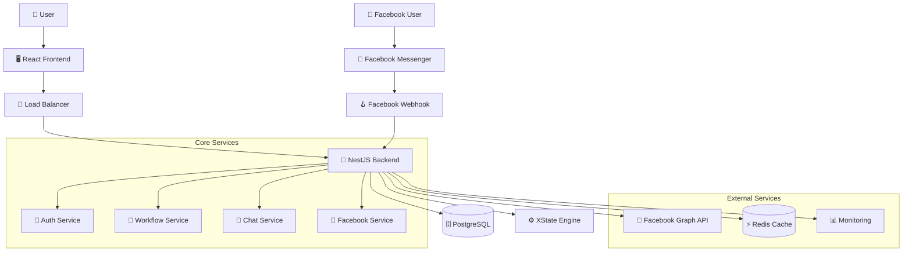
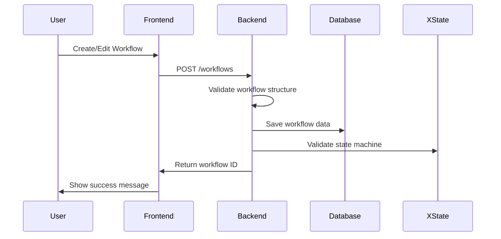
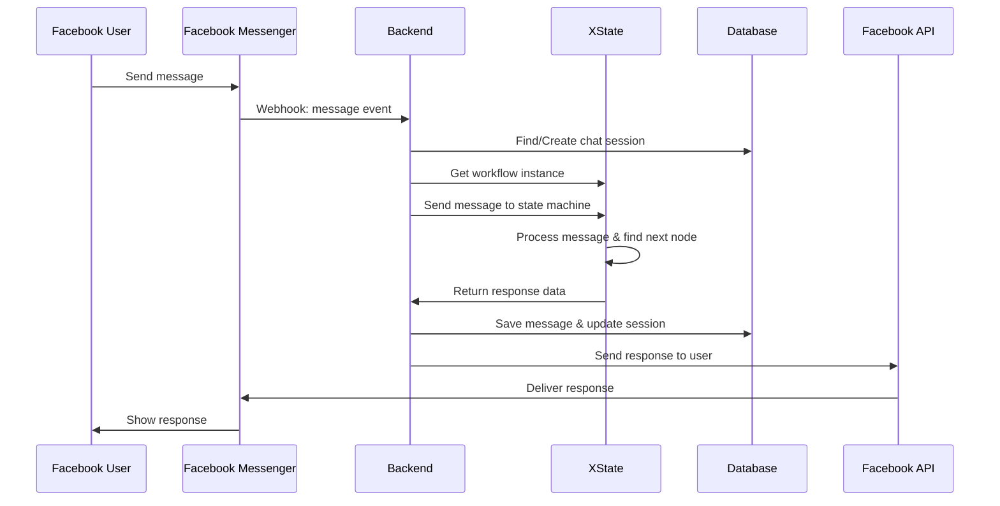
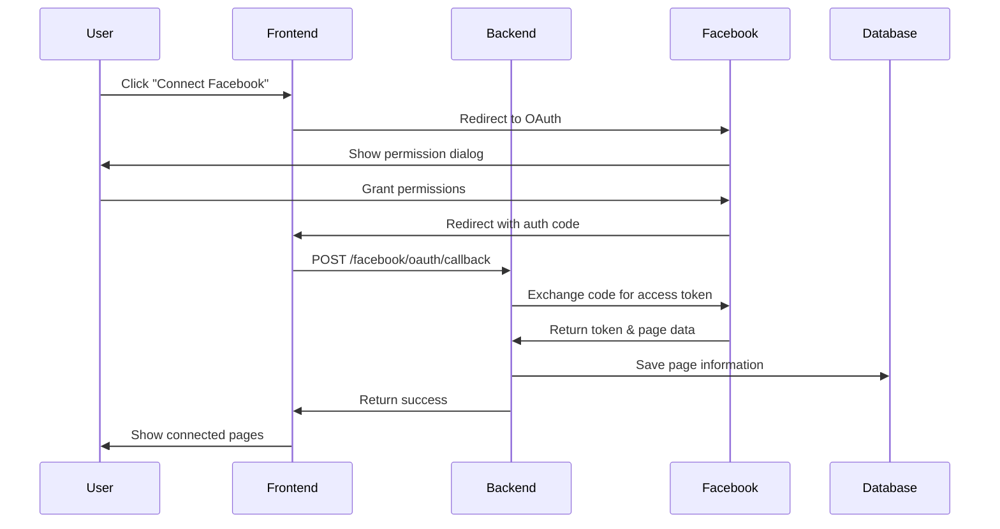
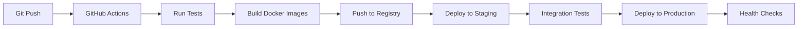

# System Architecture Documentation

## 🏗️ **Tổng quan Kiến trúc Hệ thống**

Chatbot Workflow Platform được thiết kế theo kiến trúc **microservice-oriented** với frontend và backend tách biệt, tích hợp với Facebook Messenger để tạo chatbot thông minh.

---

## 📊 **High-Level Architecture**



---

## 🎯 **Kiến trúc Layers**

### **1. Presentation Layer (Frontend)**
```
┌─────────────────────────────────────────────┐
│              React Frontend                 │
├─────────────────────────────────────────────┤
│  • Workflow Builder (ReactFlow)            │
│  • User Management UI                      │
│  • Facebook Integration UI                 │
│  • Chat Testing Interface                  │
│  • Authentication Forms                    │
└─────────────────────────────────────────────┘
```

### **2. API Gateway Layer**
```
┌─────────────────────────────────────────────┐
│             NestJS Controllers              │
├─────────────────────────────────────────────┤
│  • REST API Endpoints                      │
│  • Request Validation                      │
│  • Authentication Guards                   │
│  • Rate Limiting                           │
│  • CORS Configuration                      │
└─────────────────────────────────────────────┘
```

### **3. Business Logic Layer**
```
┌─────────────────────────────────────────────┐
│              NestJS Services                │
├─────────────────────────────────────────────┤
│  • Workflow Management                     │
│  • Chat Processing Engine                  │
│  • User Authentication                     │
│  • Facebook Integration                    │
│  • XState Machine Management               │
└─────────────────────────────────────────────┘
```

### **4. Data Access Layer**
```
┌─────────────────────────────────────────────┐
│              TypeORM + Entities             │
├─────────────────────────────────────────────┤
│  • Database Abstraction                    │
│  • Entity Relationships                    │
│  • Query Optimization                      │
│  • Migration Management                    │
│  • Connection Pooling                      │
└─────────────────────────────────────────────┘
```

### **5. Infrastructure Layer**
```
┌─────────────────────────────────────────────┐
│           Database & External APIs          │
├─────────────────────────────────────────────┤
│  • PostgreSQL Database                     │
│  • Redis Caching                           │
│  • Facebook Graph API                      │
│  • Monitoring Services                     │
│  • File Storage                            │
└─────────────────────────────────────────────┘
```

---

## 🔄 **Data Flow Architecture**

### **1. Workflow Creation Flow**


### **2. Chat Message Processing Flow**


### **3. Facebook OAuth Flow**


---

## 🧩 **Component Architecture**

### **Frontend Components**
```
├── src/
│   ├── components/
│   │   ├── auth/                    # Authentication components
│   │   │   ├── AuthContainer.tsx
│   │   │   ├── FacebookPageConnect.tsx
│   │   │   └── FacebookOAuthRedirect.tsx
│   │   ├── nodes/                   # Workflow node components
│   │   │   └── MessageNode.tsx
│   │   ├── WorkflowBuilder.tsx      # Main workflow editor
│   │   ├── WorkflowList.tsx         # Workflow management
│   │   ├── WorkflowToolbar.tsx      # Action toolbar
│   │   ├── MessageEditor.tsx        # Node content editor
│   │   └── ChatPreview.tsx          # Chat testing
│   ├── store/                       # State management
│   │   ├── workflowStore.ts
│   │   └── authStore.ts
│   ├── services/                    # API services
│   │   ├── workflowService.ts
│   │   ├── authService.ts
│   │   └── chatService.ts
│   └── App.tsx                      # Main application
```

### **Backend Modules**
```
├── src/
│   ├── auth/                        # Authentication module
│   │   ├── auth.controller.ts
│   │   ├── auth.service.ts
│   │   ├── jwt.strategy.ts
│   │   └── dto/
│   ├── workflow/                    # Workflow management
│   │   ├── workflow.controller.ts
│   │   ├── workflow.service.ts
│   │   ├── workflow.machine.ts      # XState implementation
│   │   └── dto/
│   ├── chat/                        # Chat processing
│   │   ├── chat.controller.ts
│   │   ├── chat.service.ts
│   │   └── dto/
│   ├── facebook/                    # Facebook integration
│   │   ├── facebook.controller.ts
│   │   ├── facebook.service.ts
│   │   └── dto/
│   ├── users/                       # User management
│   │   ├── users.controller.ts
│   │   ├── users.service.ts
│   │   └── dto/
│   └── entities/                    # Database entities
│       ├── user.entity.ts
│       ├── workflow.entity.ts
│       ├── facebook-page.entity.ts
│       ├── chat-session.entity.ts
│       └── chat-message.entity.ts
```

---

## ⚙️ **XState Workflow Engine Architecture**

### **State Machine Hierarchy**
```
Workflow Machine
├── waiting                 # Chờ user input
├── processing             # Xử lý message
│   ├── matched           # Message matched workflow
│   └── unmatched         # Message không match
├── responding            # Gửi response
├── unmatched            # Xử lý unmatched message
└── ended                # Workflow kết thúc
```

### **Machine Context Structure**
```typescript
interface WorkflowContext {
  currentNodeId: string;              // Node hiện tại
  userMessage: string;                // Message từ user
  botResponse: string;                // Response từ bot
  variables: Record<string, any>;     // Variables lưu trữ
  facebookUserId: string;             // Facebook user ID
  conversationHistory: Array<{        // Lịch sử conversation
    message: string;
    isFromUser: boolean;
    timestamp: Date;
  }>;
  messageMatchedWorkflow: boolean;    // Flag match status
}
```

### **Enhanced Matching Algorithm**
```typescript
function matchesNodeContent(node, userInput) {
  // 1. Start node keywords
  if (isStartKeyword(userInput)) return true;
  
  // 2. Exact payload matching
  if (exactPayloadMatch(node, userInput)) return true;
  
  // 3. Title-based matching (case-insensitive)
  if (titleMatch(node, userInput)) return true;
  
  // 4. Content-based matching
  if (contentMatch(node, userInput)) return true;
  
  // 5. Special node type handling
  if (specialNodeMatch(node, userInput)) return true;
  
  return false;
}
```

---

## 🔐 **Security Architecture**

### **Authentication & Authorization**
```
┌─────────────────────────────────────────────┐
│              Security Layers                │
├─────────────────────────────────────────────┤
│  1. JWT Authentication                      │
│  2. Route Guards (NestJS)                   │
│  3. Role-based Access Control               │
│  4. Resource Ownership Validation           │
│  5. Input Validation & Sanitization         │
│  6. Rate Limiting                           │
│  7. CORS Configuration                      │
└─────────────────────────────────────────────┘
```

### **Data Protection**
- **Encryption at Rest**: Database encryption, encrypted backups
- **Encryption in Transit**: HTTPS/TLS for all communications
- **Password Security**: bcrypt hashing với salt
- **Token Security**: JWT với secure secret, expiration
- **API Security**: Input validation, SQL injection prevention

---

## 📊 **Performance Architecture**

### **Caching Strategy**
```
┌─────────────────────────────────────────────┐
│               Caching Layers                │
├─────────────────────────────────────────────┤
│  • Browser Cache (Static assets)           │
│  • Redis Cache (Session data)              │
│  • Database Query Cache                    │
│  • XState Instance Cache                   │
│  • Facebook API Response Cache             │
└─────────────────────────────────────────────┘
```

### **Database Optimization**
- **Connection Pooling**: TypeORM connection pool
- **Indexing Strategy**: Optimized indexes cho queries
- **Query Optimization**: Efficient SQL queries
- **JSONB Usage**: Fast JSON operations trong PostgreSQL

### **Scalability Considerations**
- **Horizontal Scaling**: Multiple backend instances
- **Load Balancing**: Distribute traffic
- **Database Sharding**: Partition by user/tenant
- **Microservices**: Service separation capability

---

## 🌐 **Deployment Architecture**

### **Development Environment**
```
┌─────────────────────────────────────────────┐
│            Development Stack                │
├─────────────────────────────────────────────┤
│  • Local PostgreSQL                        │
│  • Local Redis                             │
│  • Hot Reload (Frontend & Backend)         │
│  • Debug Logging                           │
│  • Development Facebook App                │
└─────────────────────────────────────────────┘
```

### **Production Environment**
```
┌─────────────────────────────────────────────┐
│             Production Stack                │
├─────────────────────────────────────────────┤
│  • Docker Containers                       │
│  • Kubernetes Orchestration                │
│  • Load Balancer (Nginx)                   │
│  • Managed PostgreSQL                      │
│  • Redis Cluster                           │
│  • SSL Certificates                        │
│  • Monitoring & Logging                    │
│  • Backup & Recovery                       │
└─────────────────────────────────────────────┘
```

### **CI/CD Pipeline**


---

## 📈 **Monitoring & Observability**

### **Logging Strategy**
```
Application Logs
├── Error Logs           # Exceptions, failures
├── Access Logs          # API requests, responses
├── Performance Logs     # Response times, queries
├── Security Logs        # Authentication, authorization
├── Business Logs        # Workflow executions, chat sessions
└── Debug Logs          # Development debugging
```

### **Metrics Collection**
- **Application Metrics**: Response times, error rates
- **System Metrics**: CPU, memory, disk usage
- **Database Metrics**: Query performance, connections
- **Business Metrics**: User activity, workflow usage

### **Health Checks**
```typescript
// Health check endpoints
GET /health              # Basic health status
GET /health/db          # Database connectivity
GET /health/redis       # Cache connectivity
GET /health/facebook    # Facebook API status
```

---

## 🔄 **Integration Architecture**

### **Facebook Integration**
```
┌─────────────────────────────────────────────┐
│           Facebook Integration              │
├─────────────────────────────────────────────┤
│  • OAuth 2.0 Authentication                │
│  • Graph API Integration                   │
│  • Webhook Event Processing                │
│  • Page Access Token Management            │
│  • Message Sending/Receiving               │
│  • Error Handling & Retry Logic            │
└─────────────────────────────────────────────┘
```

### **API Integration Patterns**
- **RESTful APIs**: Standard REST endpoints
- **Webhooks**: Real-time event processing
- **OAuth 2.0**: Secure third-party authorization
- **GraphQL**: Efficient data fetching (future)

---

## 🚀 **Future Architecture Considerations**

### **Scalability Enhancements**
- **Message Queue**: Async processing với Redis/RabbitMQ
- **Event Sourcing**: Audit trail và replay capability
- **CQRS**: Command Query Responsibility Segregation
- **Microservices**: Service decomposition

### **AI/ML Integration**
- **NLP Processing**: Intent recognition, entity extraction
- **Machine Learning**: Conversation flow optimization
- **Analytics**: User behavior analysis
- **Personalization**: Adaptive workflow responses

### **Multi-channel Support**
- **WhatsApp Integration**: Extend beyond Facebook
- **Telegram Bot**: Additional messaging platform
- **Web Chat Widget**: Embedded chat functionality
- **Voice Interface**: Voice-based interactions

---

## 📚 **Architecture Decisions**

### **Technology Choices**
| Component | Technology | Rationale |
|-----------|------------|-----------|
| Frontend | React + TypeScript | Modern, type-safe, large ecosystem |
| Backend | NestJS + TypeScript | Scalable, decorators, dependency injection |
| Database | PostgreSQL | ACID compliance, JSONB support |
| State Management | XState | Predictable state transitions |
| Authentication | JWT | Stateless, scalable |
| API Design | REST | Simple, widely supported |

### **Design Patterns**
- **Repository Pattern**: Data access abstraction
- **Dependency Injection**: Loose coupling
- **Observer Pattern**: Event-driven architecture
- **State Machine**: Workflow state management
- **Factory Pattern**: Service instantiation

### **Best Practices**
- **Clean Architecture**: Separation of concerns
- **SOLID Principles**: Object-oriented design
- **DRY Principle**: Don't repeat yourself
- **Test-Driven Development**: Quality assurance
- **Code Documentation**: Maintainability 