# Sơ Đồ Thiết Kế Hệ Thống - Chatbot Workflow Platform

## Kiến Trúc Tổng Thể

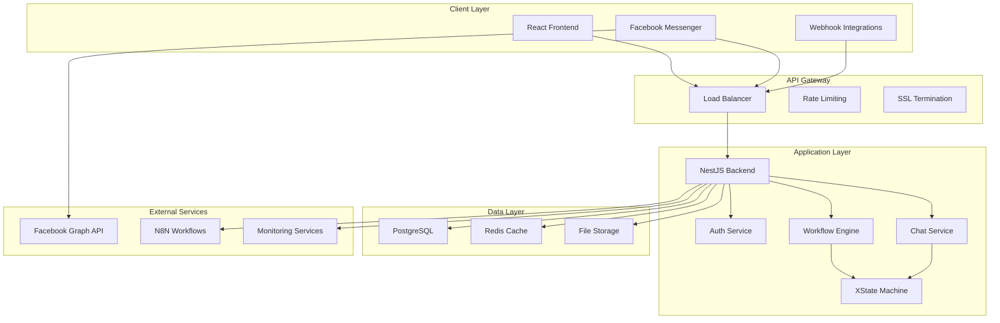

## Component Architecture

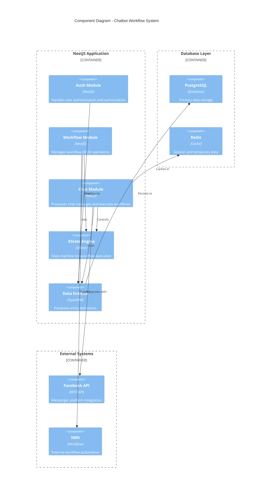

## Request Flow Architecture

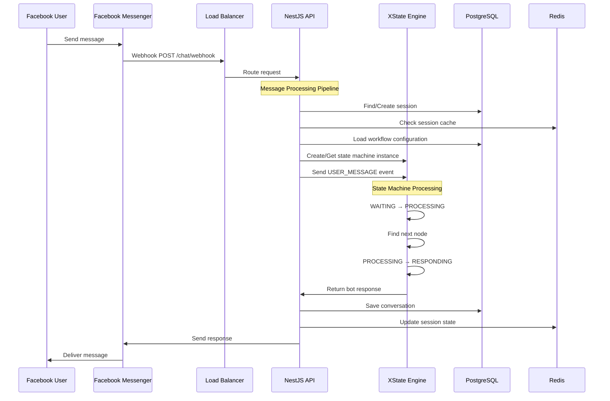

## Deployment Architecture

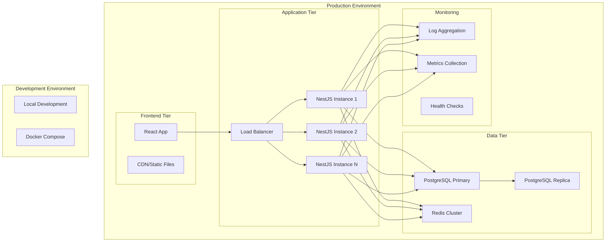

## Module Interaction Diagram

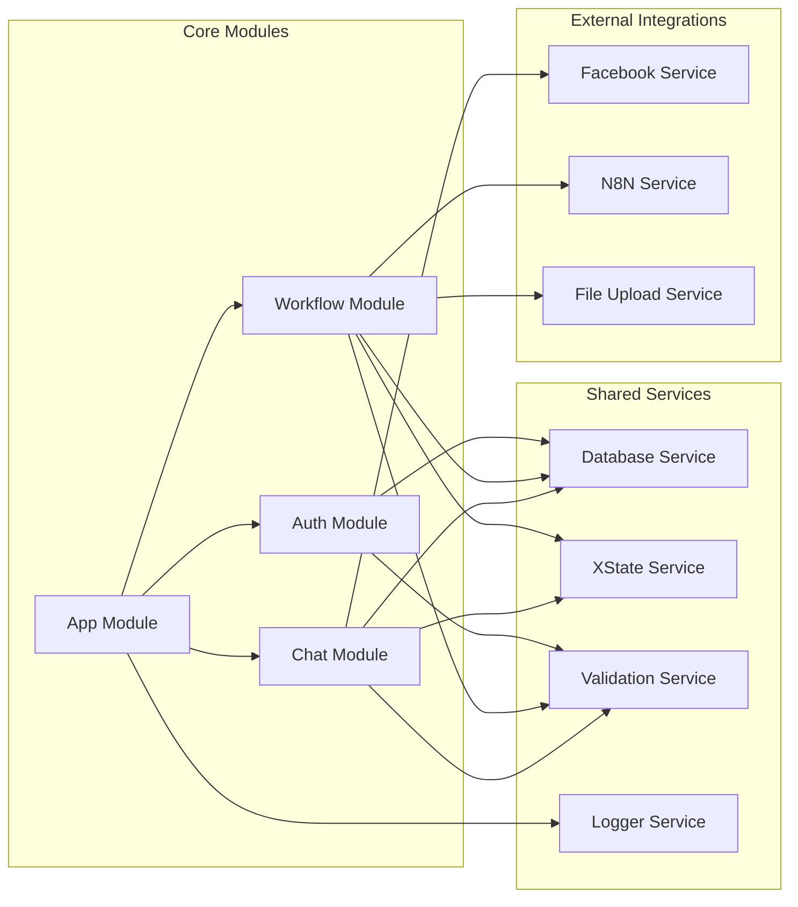

## XState Workflow Engine Architecture

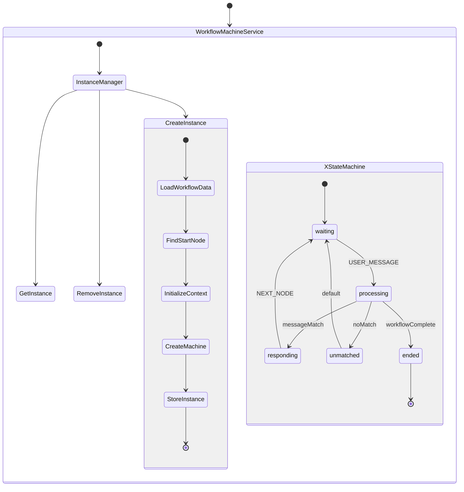

## Data Flow Architecture

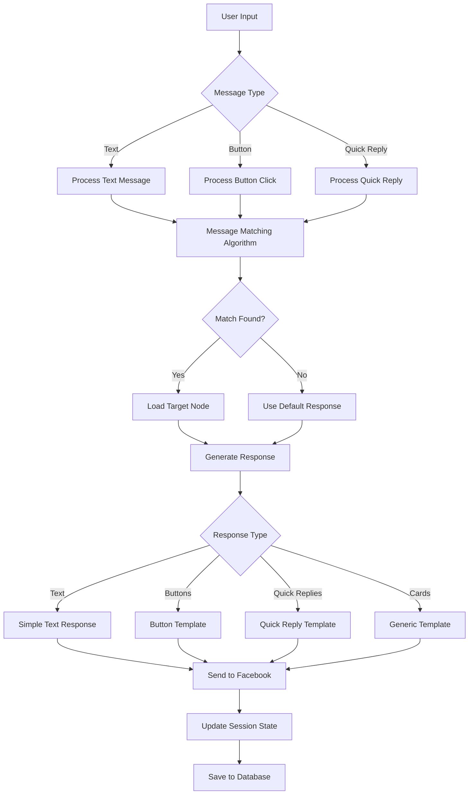

## Security Architecture

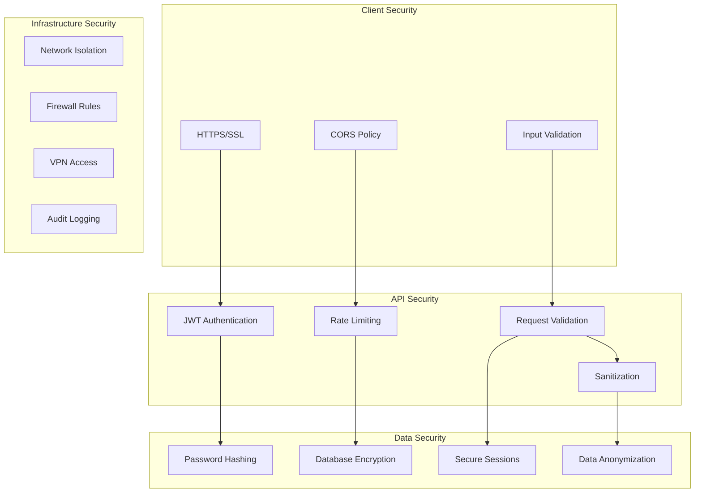

## Scaling Strategy

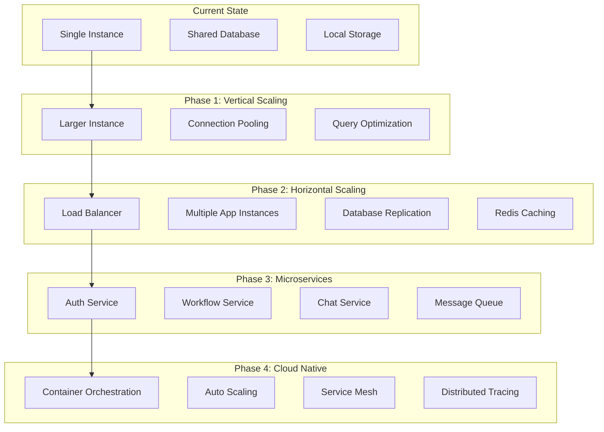

## Monitoring Architecture

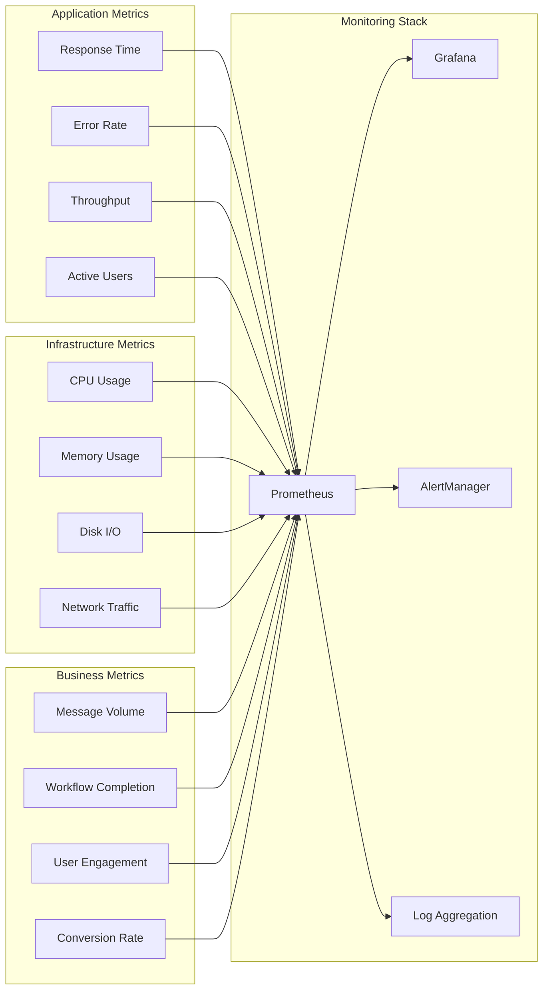

## Error Handling Flow

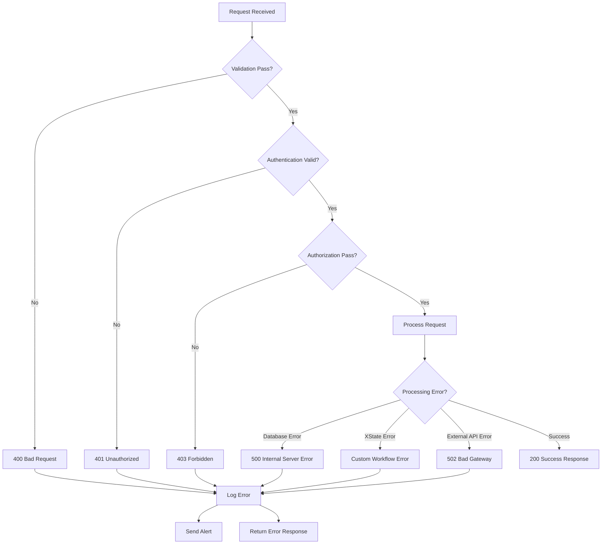

## API Design Pattern

```mermaid
graph TB
    subgraph "RESTful API Design"
        A[/api/v1/auth/*]
        B[/api/v1/workflows/*]
        C[/api/v1/chat/*]
        D[/api/v1/users/*]
    end
    
    subgraph "Authentication Endpoints"
        E[POST /auth/login]
        F[POST /auth/register]
        G[POST /auth/refresh]
        H[POST /auth/logout]
    end
    
    subgraph "Workflow Endpoints"
        I[GET /workflows]
        J[POST /workflows]
        K[PUT /workflows/:id]
        L[DELETE /workflows/:id]
        M[POST /workflows/:id/activate]
    end
    
    subgraph "Chat Endpoints"
        N[POST /chat/webhook]
        O[GET /chat/history/:userId]
        P[POST /chat/reset/:sessionId]
        Q[GET /chat/sessions]
    end
    
    A --> E
    A --> F
    A --> G
    A --> H
    B --> I
    B --> J
    B --> K
    B --> L
    B --> M
    C --> N
    C --> O
    C --> P
    C --> Q
``` 