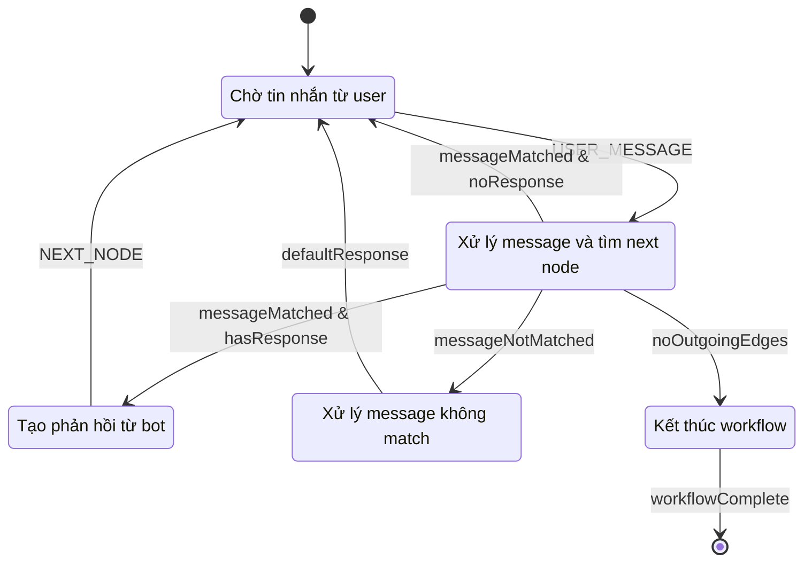
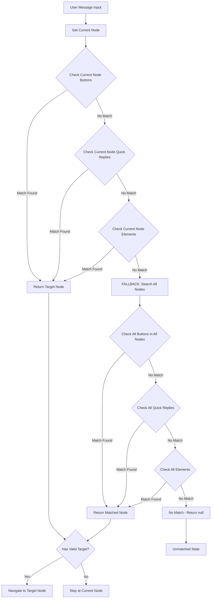
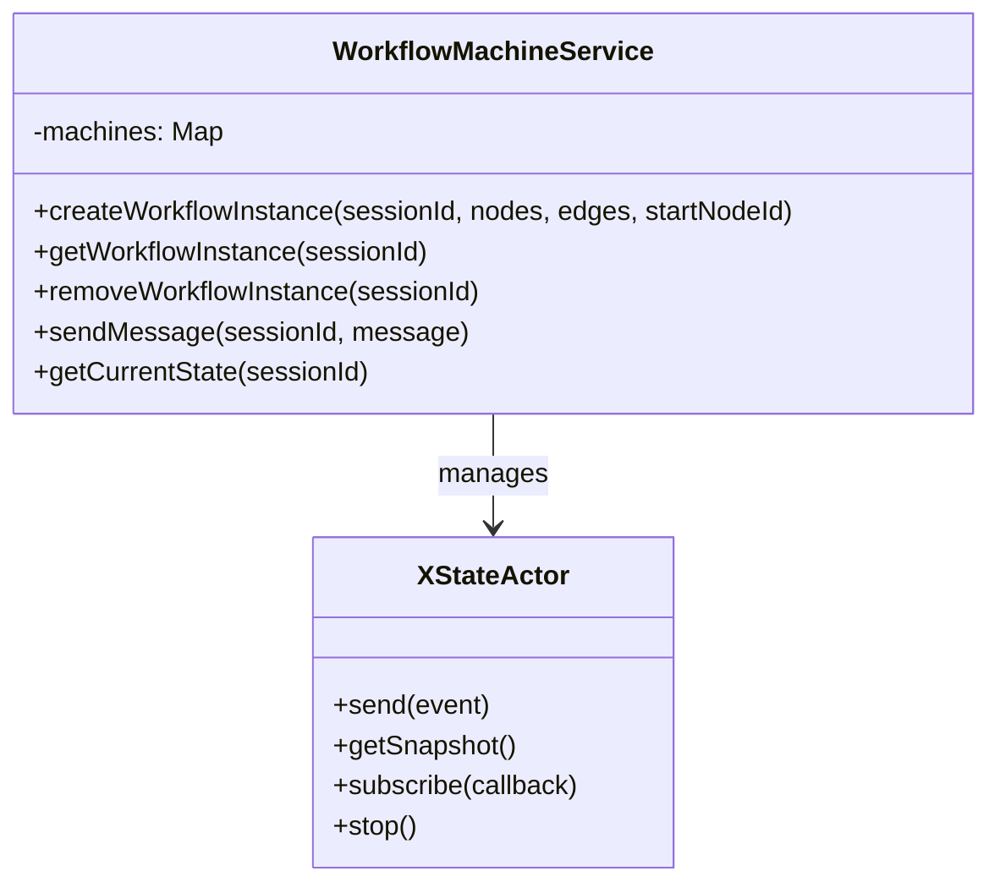
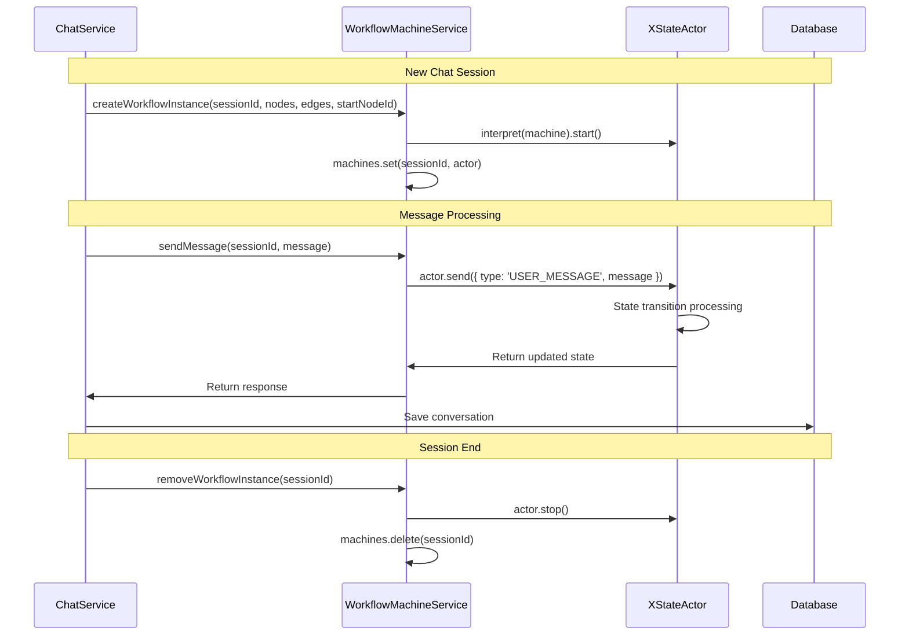
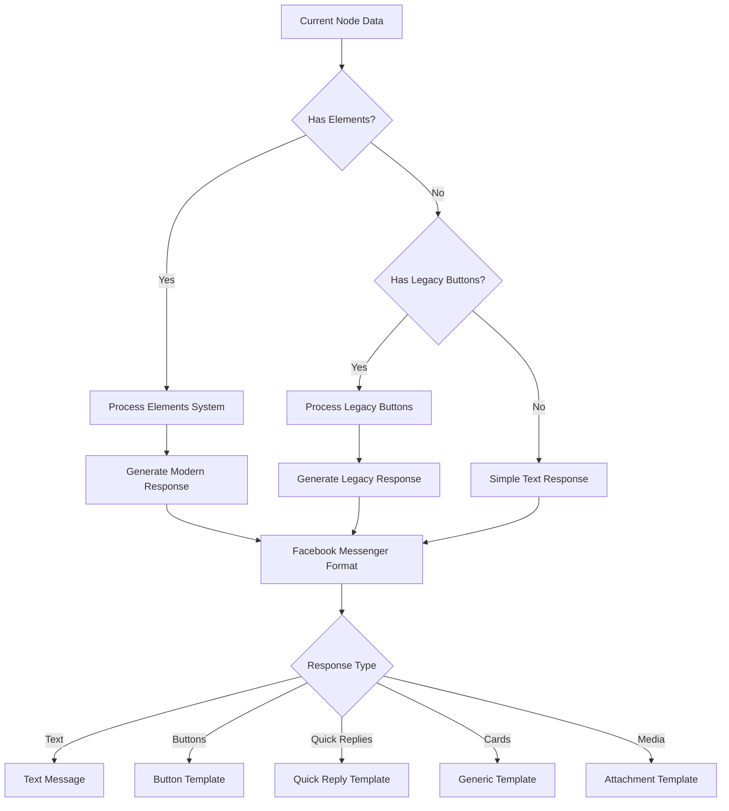
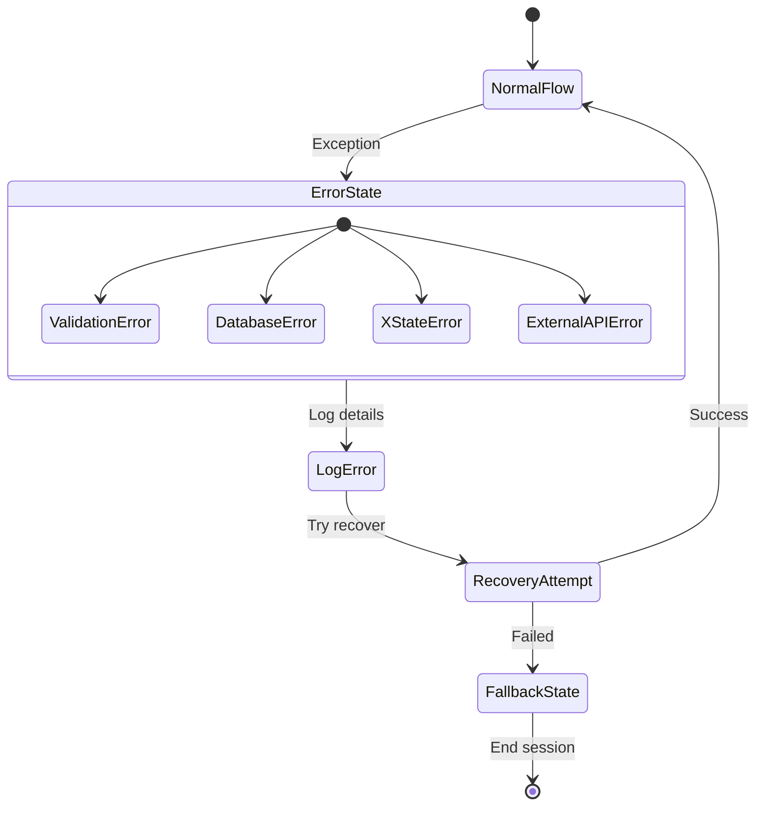

# XState Workflow Engine - Tài Liệu Chi Tiết

## Tổng Quan XState trong Hệ Thống

XState là thư viện state machine được sử dụng làm core engine để xử lý workflow chatbot. Nó cung cấp predictable state management và robust workflow execution với khả năng debug tốt.

## Kiến Trúc XState Machine

### 1. State Machine Definition



### 2. Context Structure

```typescript
interface WorkflowContext {
  // Navigation state
  currentNodeId: string;              // Node hiện tại trong workflow
  
  // Message data
  userMessage: string;                // Tin nhắn từ user
  botResponse: string;                // Phản hồi từ bot
  
  // Workflow execution
  messageMatchedWorkflow: boolean;    // Message có match với workflow không
  
  // User session
  facebookUserId: string;             // ID Facebook user
  
  // Dynamic variables
  variables: Record<string, any>;     // Biến động trong workflow
  
  // Conversation tracking
  conversationHistory: Array<{
    message: string;
    isFromUser: boolean;
    timestamp: Date;
  }>;
}
```

### 3. Event Types

```typescript
type WorkflowEvent =
  | { type: 'USER_MESSAGE'; message: string }    // User gửi tin nhắn
  | { type: 'NEXT_NODE'; nodeId?: string }       // Chuyển đến node tiếp theo
  | { type: 'RESET' }                            // Reset workflow
  | { type: 'SET_VARIABLE'; variables: Record<string, any> }; // Set biến
```

## Message Matching Algorithm

### 1. Thuật Toán Chi Tiết



### 2. Implementation Code Flow

```typescript
// Simplified version of findNextNode function
const findNextNode = (currentNodeId: string, userInput?: string): 
  { nodeId: string | null, matched: boolean } => {
  
  // 1. KIỂM TRA NODE HIỆN TẠI
  const currentNode = findNode(currentNodeId);
  
  if (userInput && currentNode) {
    // Check buttons
    const matchedButton = currentNode.data.buttons?.find(
      button => button.payload === userInput
    );
    if (matchedButton) {
      const edge = findEdgeByPayload(currentNodeId, matchedButton.payload);
      if (edge) return { nodeId: edge.target, matched: true };
    }
    
    // Check quick replies
    const matchedQuickReply = currentNode.data.quickReplies?.find(
      reply => reply.payload === userInput
    );
    if (matchedQuickReply) {
      const edge = findEdgeByPayload(currentNodeId, matchedQuickReply.payload);
      if (edge) return { nodeId: edge.target, matched: true };
    }
    
    // Check elements system
    for (const element of currentNode.data.elements || []) {
      if (element.type === 'button' && element.payload === userInput) {
        const edge = findEdgeByPayload(currentNodeId, element.payload);
        if (edge) return { nodeId: edge.target, matched: true };
      }
    }
  }
  
  // 2. FALLBACK: TÌM KIẾM TẤT CẢ NODES
  for (const node of nodes) {
    if (node.id === currentNodeId) continue;
    
    // Tương tự logic kiểm tra cho tất cả nodes
    // ...
  }
  
  return { nodeId: null, matched: false };
};
```

## State Machine States

### 1. WAITING State

```typescript
waiting: {
  on: {
    USER_MESSAGE: {
      target: 'processing',
      actions: assign({
        userMessage: ({ event }) => event.message,
        conversationHistory: ({ context, event }) => [
          ...context.conversationHistory,
          {
            message: event.message,
            isFromUser: true,
            timestamp: new Date(),
          },
        ],
      }),
    },
    RESET: {
      target: 'waiting',
      actions: assign({
        currentNodeId: startNodeId,
        userMessage: '',
        botResponse: '',
        variables: {},
        conversationHistory: [],
        messageMatchedWorkflow: false,
      }),
    },
  },
}
```

**Nhiệm vụ:**
- Chờ input từ user
- Lưu user message vào context
- Cập nhật conversation history
- Hỗ trợ reset workflow

### 2. PROCESSING State

```typescript
processing: {
  entry: assign({
    currentNodeId: ({ context }) => {
      const { nodeId, matched } = findNextNode(context.currentNodeId, context.userMessage);
      return nodeId || context.currentNodeId;
    },
    messageMatchedWorkflow: ({ context }) => {
      const { nodeId, matched } = findNextNode(context.currentNodeId, context.userMessage);
      return matched;
    },
  }),
  always: [
    {
      target: 'responding',
      guard: ({ context }) => {
        const currentNode = findNode(context.currentNodeId);
        return !!currentNode?.data.message && context.messageMatchedWorkflow;
      },
    },
    {
      target: 'unmatched',
      guard: ({ context }) => !context.messageMatchedWorkflow,
    },
    {
      target: 'ended',
      guard: ({ context }) => {
        const outgoingEdges = edges.filter((edge) => edge.source === context.currentNodeId);
        return outgoingEdges.length === 0;
      },
    },
    {
      target: 'waiting',
    },
  ],
}
```

**Logic Flow:**
1. **Entry Action**: Tìm next node và cập nhật match status
2. **Guards**: Kiểm tra điều kiện để chuyển state
3. **Transitions**: Chuyển đến state phù hợp

### 3. RESPONDING State

```typescript
responding: {
  entry: assign({
    botResponse: ({ context }) => {
      const currentNode = findNode(context.currentNodeId);
      return currentNode?.data.message || 'No response available';
    },
    conversationHistory: ({ context }) => [
      ...context.conversationHistory,
      {
        message: context.botResponse,
        isFromUser: false,
        timestamp: new Date(),
      },
    ],
  }),
  on: {
    NEXT_NODE: {
      target: 'waiting',
    },
  },
}
```

**Nhiệm vụ:**
- Generate bot response từ current node
- Cập nhật conversation history
- Chờ trigger NEXT_NODE để tiếp tục

### 4. UNMATCHED State

```typescript
unmatched: {
  entry: assign({
    botResponse: 'Xin lỗi, tôi không hiểu yêu cầu của bạn.',
  }),
  always: {
    target: 'waiting',
  },
}
```

**Xử lý:**
- Tin nhắn không match với bất kỳ node nào
- Trả về default response
- Quay về WAITING state

### 5. ENDED State

```typescript
ended: {
  type: 'final',
  entry: assign({
    botResponse: 'Cảm ơn bạn đã sử dụng dịch vụ!',
  }),
}
```

**Kết thúc:**
- Workflow hoàn thành (không có outgoing edges)
- State machine kết thúc

## WorkflowMachineService

### 1. Service Architecture



### 2. Instance Management

```typescript
export class WorkflowMachineService {
  private machines: Map<string, ActorRefFrom<ReturnType<typeof createWorkflowMachine>>> = new Map();

  createWorkflowInstance(
    sessionId: string,
    nodes: WorkflowNode[],
    edges: WorkflowEdge[],
    startNodeId: string,
  ) {
    // Tạo machine definition
    const machine = createWorkflowMachine(nodes, edges, startNodeId);
    
    // Tạo actor instance
    const actor = interpret(machine).start();
    
    // Lưu vào Map để quản lý
    this.machines.set(sessionId, actor);
    
    return actor;
  }

  getWorkflowInstance(sessionId: string) {
    return this.machines.get(sessionId);
  }

  removeWorkflowInstance(sessionId: string) {
    const machine = this.machines.get(sessionId);
    if (machine) {
      machine.stop();
      this.machines.delete(sessionId);
    }
  }
}
```

### 3. Session Lifecycle



## Node Types và Data Processing

### 1. Legacy Node Structure

```typescript
interface LegacyNode {
  id: string;
  type: string;
  data: {
    label: string;
    message?: string;
    buttons?: Array<{
      title: string;
      payload: string;
    }>;
    quickReplies?: Array<{
      title: string;
      payload: string;
      imageUrl?: string;
    }>;
  };
}
```

### 2. New Elements System

```typescript
interface ModernNode {
  id: string;
  type: string;
  data: {
    label: string;
    elements?: Array<{
      type: 'text' | 'image' | 'video' | 'button' | 'quick_reply' | 'generic_card';
      content?: string;
      title?: string;
      subtitle?: string;
      imageUrl?: string;
      payload?: string;
      url?: string;
      buttons?: Array<{
        type: 'postback' | 'web_url' | 'phone_number';
        title: string;
        payload?: string;
        url?: string;
      }>;
    }>;
  };
}
```

### 3. Response Generation Flow



## Integration với Chat Service

### 1. Message Processing Pipeline

```typescript
async processMessage(
  facebookUserId: string,
  message: string,
  workflowId?: string,
): Promise<ChatResponse> {
  
  // 1. Find or create session
  const session = await this.findOrCreateSession(facebookUserId, workflowId);
  
  // 2. Load workflow
  const workflow = await this.loadWorkflow(session.workflowId);
  
  // 3. Detect button/quick reply
  const { isButton, buttonTitle } = this.detectInteraction(message, workflow, session);
  
  // 4. Save user message
  await this.saveMessage(session.id, facebookUserId, 
    isButton ? buttonTitle : message, true, 
    isButton ? 'button' : 'text'
  );
  
  // 5. Get or create XState instance
  let workflowInstance = this.workflowMachine.getWorkflowInstance(session.id);
  if (!workflowInstance) {
    const startNode = this.findStartNode(workflow.nodes);
    workflowInstance = this.workflowMachine.createWorkflowInstance(
      session.id, workflow.nodes, workflow.edges, startNode.id
    );
  }
  
  // 6. Send message to XState
  workflowInstance.send({ type: 'USER_MESSAGE', message });
  
  // 7. Get current state and generate response
  const currentState = workflowInstance.getSnapshot();
  const botResponse = this.generateResponse(currentState, session.id);
  
  // 8. Save bot message
  await this.saveMessage(session.id, facebookUserId, 
    botResponse.text || '', false, botResponse.messageType
  );
  
  return botResponse;
}
```

### 2. Response Generation

```typescript
private generateMessengerResponse(node: any, sessionId: string, context: any): ChatResponse {
  const response: ChatResponse = {
    sessionId,
    workflowEnded: false,
    inWorkFlowMsg: true,
    messageType: 'text',
  };

  // Process elements system (modern approach)
  if (node.data.elements && node.data.elements.length > 0) {
    return this.processElementsSystem(node.data.elements, response);
  }
  
  // Fallback to legacy system
  if (node.data.buttons && node.data.buttons.length > 0) {
    return this.processLegacyButtons(node.data, response);
  }
  
  if (node.data.quickReplies && node.data.quickReplies.length > 0) {
    return this.processLegacyQuickReplies(node.data, response);
  }
  
  // Simple text message
  response.text = node.data.message || 'No message available';
  return response;
}
```

## Error Handling và Debugging

### 1. Error States



### 2. Debugging Tools

```typescript
// XState Inspector Integration (development)
const machine = createWorkflowMachine(nodes, edges, startNodeId).provide({
  inspect: {
    // Enable XState inspector for debugging
    url: 'https://stately.ai/registry/editor/...',
    iframe: false,
  },
});

// Logging cho state transitions
const actor = interpret(machine, {
  logger: (msg) => {
    console.log(`[XState ${sessionId}]:`, msg);
  },
}).start();

// Error handling
actor.subscribe({
  error: (error) => {
    console.error(`[XState Error ${sessionId}]:`, error);
    // Send to monitoring service
    this.monitoringService.logError('xstate_error', error, { sessionId });
  },
});
```

### 3. Performance Monitoring

```typescript
// Metrics collection
const startTime = Date.now();

workflowInstance.send({ type: 'USER_MESSAGE', message });

const processingTime = Date.now() - startTime;

// Log performance metrics
this.metricsService.histogram('xstate_processing_time', processingTime, {
  workflow_id: workflowId,
  node_type: currentNode.type,
});
```

## Best Practices

### 1. State Machine Design

- **Single Responsibility**: Mỗi state có một nhiệm vụ cụ thể
- **Predictable Transitions**: Guards và conditions rõ ràng
- **Error Boundaries**: Xử lý lỗi ở từng state
- **Resource Cleanup**: Proper cleanup khi kết thúc workflow

### 2. Memory Management

```typescript
// Cleanup strategy for long-running sessions
const SESSION_TIMEOUT = 30 * 60 * 1000; // 30 minutes

setInterval(() => {
  const now = Date.now();
  for (const [sessionId, lastActivity] of this.sessionActivity.entries()) {
    if (now - lastActivity > SESSION_TIMEOUT) {
      this.workflowMachine.removeWorkflowInstance(sessionId);
      this.sessionActivity.delete(sessionId);
    }
  }
}, 5 * 60 * 1000); // Check every 5 minutes
```

### 3. Testing Strategy

```typescript
// Unit tests for state machine
describe('WorkflowMachine', () => {
  it('should transition from waiting to processing on USER_MESSAGE', () => {
    const machine = createWorkflowMachine(mockNodes, mockEdges, 'start');
    const actor = interpret(machine).start();
    
    actor.send({ type: 'USER_MESSAGE', message: 'hello' });
    
    expect(actor.getSnapshot().value).toBe('processing');
  });
  
  it('should handle unmatched messages', () => {
    // Test unmatched state handling
  });
  
  it('should complete workflow when reaching end node', () => {
    // Test workflow completion
  });
});
```

## Kết Luận

XState Workflow Engine cung cấp:

1. **Predictable State Management**: State transitions rõ ràng và có thể debug
2. **Flexible Node System**: Hỗ trợ cả legacy và modern node structures
3. **Robust Message Matching**: Algorithm phức tạp để match user input
4. **Scalable Architecture**: Instance management cho multiple sessions
5. **Error Resilience**: Comprehensive error handling và recovery
6. **Performance Monitoring**: Built-in metrics và logging

Engine này là foundation để xây dựng các chatbot workflow phức tạp với khả năng maintain và extend cao. 