# XState Workflow Engine Documentation

## 🤖 **Tổng quan XState Engine**

XState Workflow Engine là core component của hệ thống chatbot, quản lý luồng hội thoại thông qua **finite state machines**. Engine được thiết kế để xử lý các conversation flows phức tạp với khả năng matching thông minh và debug capabilities mạnh mẽ.

---

## ⚙️ **Architecture Overview**

```mermaid
graph TB
    User[👤 User Input] --> Machine[🤖 XState Machine]
    Machine --> Matcher[🔍 Content Matcher]
    Machine --> Navigator[🧭 Node Navigator]
    Machine --> Context[📊 Context Manager]
    
    Matcher --> Enhanced[✨ Enhanced Matching]
    Enhanced --> Exact[🎯 Exact Matching]
    Enhanced --> Fuzzy[🔄 Fuzzy Matching]
    Enhanced --> Fallback[🔄 Fallback Search]
    
    Navigator --> EdgeSelector[🔗 Edge Selector]
    EdgeSelector --> ButtonMap[🔘 Button Mapping]
    EdgeSelector --> IndexMap[📍 Index Mapping]
    
    Context --> Variables[📝 Variables]
    Context --> History[📚 History]
    Context --> State[🔄 State Tracking]
```



---

## 🔄 **State Machine Definition**

### **Machine States**
```typescript
interface WorkflowStates {
  waiting: {
    // Chờ user input
    // Trigger: USER_MESSAGE event
  };
  processing: {
    // Xử lý message và tìm next node
    // Logic: findNextNode(), matchesNodeContent()
  };
  responding: {
    // Gửi response từ workflow node
    // Output: botResponse trong context
  };
  unmatched: {
    // Xử lý khi message không match workflow
    // Fallback: Return original user message
  };
  ended: {
    // Workflow kết thúc (no outgoing edges)
    // Terminal state
  };
}
```

### **State Transitions**


---

## 🧠 **Enhanced Matching Logic**

### **Matching Priority Order**
```typescript
function matchesNodeContent(node: WorkflowNode, userInput: string): boolean {
  const input = userInput.toLowerCase().trim();
  
  // 1. 🚀 START NODE DETECTION
  if (isStartNode(node) && hasStartKeywords(input)) {
    return true;
  }
  
  // 2. 🎯 EXACT PAYLOAD MATCHING
  if (hasExactPayloadMatch(node, userInput)) {
    return true;
  }
  
  // 3. 📝 TITLE-BASED MATCHING
  if (hasTitleMatch(node, input)) {
    return true;
  }
  
  // 4. 📄 CONTENT MATCHING
  if (hasContentMatch(node, input)) {
    return true;
  }
  
  // 5. 🎭 SPECIAL NODE TYPES
  if (hasSpecialNodeMatch(node, input)) {
    return true;
  }
  
  return false;
}
```

### **Start Node Keywords**
```typescript
const START_KEYWORDS = [
  // Vietnamese
  'start', 'bắt đầu', 'khởi động', 'reset', 'restart', 
  'về đầu', 'quay lại', 'chào', 'xin chào', 
  'menu chính', 'trang chủ',
  
  // English
  'hello', 'hi', 'hey', 'start over', 'begin',
  'main menu', 'home', 'back to start'
];
```

### **Button-to-Edge Mapping Algorithm**
```typescript
function findNextNode(currentNodeId: string, userInput?: string) {
  const outgoingEdges = edges.filter(edge => edge.source === currentNodeId);
  
  if (userInput && matchesCurrentNode(userInput)) {
    // For exact payload matches
    const buttonMatch = findButtonMatch(currentNode, userInput);
    if (buttonMatch) {
      // Try sourceHandle first, then button index mapping
      let edge = outgoingEdges.find(e => e.sourceHandle === buttonMatch.payload);
      
      if (!edge && outgoingEdges.length > 1) {
        // Use button index to select corresponding edge
        const buttonIndex = getButtonIndex(buttonMatch);
        edge = outgoingEdges[buttonIndex] || outgoingEdges[0];
      }
      
      return edge?.target || null;
    }
  }
  
  // Fallback search in all nodes (start node prioritized)
  return fallbackSearch(userInput);
}
```

---

## 📊 **Context Management**

### **WorkflowContext Interface**
```typescript
interface WorkflowContext {
  // Navigation
  currentNodeId: string;
  messageMatchedWorkflow: boolean;
  
  // Communication
  userMessage: string;
  botResponse: string;
  
  // User data
  facebookUserId: string;
  variables: Record<string, any>;
  
  // History tracking
  conversationHistory: Array<{
    message: string;
    isFromUser: boolean;
    timestamp: Date;
  }>;
}
```

### **Context Updates**
```typescript
// Entry actions cho các states
const contextActions = {
  waiting: assign({
    userMessage: ({ event }) => event.message,
    conversationHistory: ({ context, event }) => [
      ...context.conversationHistory,
      {
        message: event.message,
        isFromUser: true,
        timestamp: new Date(),
      }
    ]
  }),
  
  processing: assign({
    currentNodeId: ({ context }) => {
      const { nodeId } = findNextNode(context.currentNodeId, context.userMessage);
      return nodeId || context.currentNodeId;
    },
    messageMatchedWorkflow: ({ context }) => {
      const { matched } = findNextNode(context.currentNodeId, context.userMessage);
      return matched;
    }
  }),
  
  responding: assign({
    botResponse: ({ context }) => {
      const currentNode = findNode(context.currentNodeId);
      return currentNode?.data.message || 'No response available';
    },
    conversationHistory: ({ context }) => [
      ...context.conversationHistory,
      {
        message: context.botResponse,
        isFromUser: false,
        timestamp: new Date(),
      }
    ]
  })
};
```

---

## 🔍 **Enhanced Debug System**

### **Debug Logging Levels**
```typescript
enum DebugLevel {
  WORKFLOW = '[WORKFLOW DEBUG]',
  FINDNODE = '[FINDNODE DEBUG]',
  MATCHER = '[MATCHER DEBUG]',
  EDGE = '[EDGE DEBUG]',
  BUTTON = '[BUTTON DEBUG]'
}
```

### **Comprehensive Debug Output**
```typescript
function debugNodeMatching(node: WorkflowNode, userInput: string) {
  console.log(`${DebugLevel.WORKFLOW} Checking node ${node.id} (${node.data.label}) against input: "${userInput}"`);
  
  // Start node detection
  if (isStartNode(node)) {
    console.log(`${DebugLevel.WORKFLOW} This is a START NODE`);
  }
  
  // Button analysis
  if (node.data.buttons) {
    console.log(`${DebugLevel.BUTTON} Node has ${node.data.buttons.length} legacy buttons:`, node.data.buttons);
    node.data.buttons.forEach((button, index) => {
      const payloadMatch = button.payload === userInput;
      const titleMatch = button.title.toLowerCase().includes(userInput.toLowerCase());
      console.log(`${DebugLevel.BUTTON} Button[${index}] "${button.title}" (payload: "${button.payload}") - Payload: ${payloadMatch}, Title: ${titleMatch}`);
    });
  }
  
  // Element analysis
  if (node.data.elements) {
    console.log(`${DebugLevel.WORKFLOW} Node has ${node.data.elements.length} elements:`, node.data.elements);
    // ... detailed element analysis
  }
}
```

### **Edge Selection Debug**
```typescript
function debugEdgeSelection(buttonIndex: number, edges: WorkflowEdge[], selectedEdge: WorkflowEdge) {
  console.log(`${DebugLevel.EDGE} Button index: ${buttonIndex}`);
  console.log(`${DebugLevel.EDGE} Available edges:`, edges);
  console.log(`${DebugLevel.EDGE} Selected edge:`, selectedEdge);
  console.log(`${DebugLevel.EDGE} Target node: ${selectedEdge.target}`);
}
```

---

## 🎯 **Advanced Matching Features**

### **Element Type Support**
```typescript
interface WorkflowElement {
  type: 'button' | 'quick_reply' | 'text' | 'image' | 'video' | 'file' | 'generic_card' | 'list_item';
  
  // Common properties
  title?: string;
  payload?: string;
  
  // Type-specific properties
  content?: string;              // text
  imageUrl?: string;            // image
  fileUrl?: string;             // video, file
  quickReplyPayload?: string;   // quick_reply
  subtitle?: string;            // generic_card, list_item
  buttons?: Button[];           // generic_card
}
```

### **Element Matching Logic**
```typescript
function matchElement(element: WorkflowElement, userInput: string): boolean {
  const input = userInput.toLowerCase();
  
  switch (element.type) {
    case 'button':
      return element.payload === userInput || 
             element.title?.toLowerCase() === input;
             
    case 'quick_reply':
      return element.quickReplyPayload === userInput ||
             element.title?.toLowerCase() === input;
             
    case 'text':
      return element.content?.toLowerCase().includes(input);
      
    case 'image':
    case 'video':
    case 'file':
      return element.title?.toLowerCase().includes(input) ||
             element.fileUrl?.toLowerCase().includes(input);
             
    case 'generic_card':
      return element.title?.toLowerCase().includes(input) ||
             element.subtitle?.toLowerCase().includes(input) ||
             element.buttons?.some(btn => matchButton(btn, userInput));
             
    case 'list_item':
      return element.title?.toLowerCase().includes(input) ||
             element.subtitle?.toLowerCase().includes(input);
             
    default:
      return false;
  }
}
```

### **Receipt Node Handling**
```typescript
function matchReceiptNode(node: WorkflowNode, userInput: string): boolean {
  if (node.data.messageType !== 'receipt') return false;
  
  const input = userInput.toLowerCase();
  
  // Receipt keywords
  const receiptKeywords = [
    'receipt', 'bill', 'order', 'payment', 'invoice',
    'hóa đơn', 'đơn hàng', 'thanh toán'
  ];
  
  if (receiptKeywords.some(keyword => input.includes(keyword))) {
    return true;
  }
  
  // Receipt-specific fields
  const recipientMatch = node.data.recipientName?.toLowerCase().includes(input);
  const orderMatch = node.data.orderNumber?.toLowerCase().includes(input);
  
  return recipientMatch || orderMatch;
}
```

---

## 🔄 **Fallback Search Strategy**

### **Prioritized Node Search**
```typescript
function fallbackSearch(userInput: string): { nodeId: string | null, matched: boolean } {
  console.log(`${DebugLevel.FINDNODE} Searching in all nodes for fallback match...`);
  
  // Create prioritized search list
  const startNode = findNode(startNodeId);
  const otherNodes = nodes.filter(node => 
    node.id !== currentNodeId && node.id !== startNodeId
  );
  const nodesToSearch = startNode ? [startNode, ...otherNodes] : otherNodes;
  
  console.log(`${DebugLevel.FINDNODE} Searching in ${nodesToSearch.length} nodes (start node first)`);
  
  // Enhanced matching for all nodes
  for (const node of nodesToSearch) {
    console.log(`${DebugLevel.FINDNODE} Checking fallback node: ${node.id} (${node.data.label})`);
    
    if (matchesNodeContent(node, userInput)) {
      console.log(`${DebugLevel.FINDNODE} ✅ Found fallback match in node: ${node.id}`);
      return { nodeId: node.id, matched: true };
    }
  }
  
  console.log(`${DebugLevel.FINDNODE} ❌ No match found anywhere in workflow`);
  return { nodeId: null, matched: false };
}
```

### **Start Node Accessibility**
```typescript
function checkStartKeywords(userInput: string): boolean {
  const input = userInput.toLowerCase().trim();
  const startKeywords = [
    'start', 'bắt đầu', 'khởi động', 'reset', 'restart', 
    'về đầu', 'quay lại', 'chào', 'hello', 'hi', 'xin chào', 
    'menu chính', 'trang chủ'
  ];
  
  return startKeywords.some(keyword => input.includes(keyword));
}
```

---

## 🛠️ **Machine Service Management**

### **WorkflowMachineService Class**
```typescript
export class WorkflowMachineService {
  private machines: Map<string, ActorRefFrom<ReturnType<typeof createWorkflowMachine>>> = new Map();

  createWorkflowInstance(
    sessionId: string,
    nodes: WorkflowNode[],
    edges: WorkflowEdge[],
    startNodeId: string,
  ) {
    const machine = createWorkflowMachine(nodes, edges, startNodeId);
    const service = interpret(machine);
    
    this.machines.set(sessionId, service);
    service.start();
    
    return service;
  }

  sendMessage(sessionId: string, message: string) {
    const service = this.machines.get(sessionId);
    if (service) {
      service.send({ type: 'USER_MESSAGE', message });
      return service.getSnapshot().context;
    }
    return null;
  }

  getCurrentState(sessionId: string) {
    const service = this.machines.get(sessionId);
    return service?.getSnapshot().context || null;
  }

  removeWorkflowInstance(sessionId: string) {
    const service = this.machines.get(sessionId);
    if (service) {
      service.stop();
      this.machines.delete(sessionId);
    }
  }
}
```

---

## 📈 **Performance Optimizations**

### **Caching Strategy**
```typescript
interface MachineCache {
  compiledWorkflows: Map<string, CompiledMachine>;
  sessionInstances: Map<string, MachineInstance>;
  nodeIndexes: Map<string, NodeIndex>;
}

class OptimizedMachineService {
  private cache: MachineCache = {
    compiledWorkflows: new Map(),
    sessionInstances: new Map(),
    nodeIndexes: new Map()
  };
  
  getCachedMachine(workflowId: string): CompiledMachine | null {
    return this.cache.compiledWorkflows.get(workflowId) || null;
  }
  
  buildNodeIndex(nodes: WorkflowNode[]): NodeIndex {
    return nodes.reduce((index, node) => {
      // Index by ID
      index.byId[node.id] = node;
      
      // Index by type
      if (!index.byType[node.type]) {
        index.byType[node.type] = [];
      }
      index.byType[node.type].push(node);
      
      // Index by content for faster searching
      if (node.data.message) {
        index.byContent[node.data.message.toLowerCase()] = node;
      }
      
      return index;
    }, { byId: {}, byType: {}, byContent: {} });
  }
}
```

### **Memory Management**
```typescript
class SessionManager {
  private readonly MAX_SESSIONS = 1000;
  private readonly SESSION_TTL = 24 * 60 * 60 * 1000; // 24 hours
  
  cleanupExpiredSessions() {
    const now = Date.now();
    
    for (const [sessionId, instance] of this.machines.entries()) {
      const lastActivity = instance.lastActivity || 0;
      
      if (now - lastActivity > this.SESSION_TTL) {
        this.removeWorkflowInstance(sessionId);
        console.log(`[CLEANUP] Removed expired session: ${sessionId}`);
      }
    }
  }
  
  enforceSessionLimit() {
    if (this.machines.size > this.MAX_SESSIONS) {
      // Remove oldest sessions
      const sessions = Array.from(this.machines.entries())
        .sort(([,a], [,b]) => (a.lastActivity || 0) - (b.lastActivity || 0))
        .slice(0, this.machines.size - this.MAX_SESSIONS);
        
      sessions.forEach(([sessionId]) => {
        this.removeWorkflowInstance(sessionId);
      });
    }
  }
}
```

---

## 🧪 **Testing Strategy**

### **Unit Tests**
```typescript
describe('XState Workflow Engine', () => {
  describe('matchesNodeContent', () => {
    it('should match exact payload', () => {
      const node = createTestNode({
        buttons: [{ title: 'Menu', payload: 'MENU' }]
      });
      
      expect(matchesNodeContent(node, 'MENU')).toBe(true);
    });
    
    it('should match case-insensitive title', () => {
      const node = createTestNode({
        buttons: [{ title: 'Menu', payload: 'MENU' }]
      });
      
      expect(matchesNodeContent(node, 'menu')).toBe(true);
    });
    
    it('should prioritize start keywords', () => {
      const node = createTestNode({ id: startNodeId });
      
      expect(matchesNodeContent(node, 'bắt đầu')).toBe(true);
      expect(matchesNodeContent(node, 'start')).toBe(true);
    });
  });
  
  describe('findNextNode', () => {
    it('should map button to correct edge', () => {
      const result = findNextNode('node1', 'MENU');
      
      expect(result.nodeId).toBe('menu-node');
      expect(result.matched).toBe(true);
    });
    
    it('should handle fallback search', () => {
      const result = findNextNode('node1', 'unknown');
      
      expect(result.matched).toBe(false);
    });
  });
});
```

### **Integration Tests**
```typescript
describe('Workflow Machine Integration', () => {
  it('should process complete conversation flow', async () => {
    const machine = createWorkflowMachine(testNodes, testEdges, 'start');
    const service = interpret(machine);
    
    service.start();
    
    // Send first message
    service.send({ type: 'USER_MESSAGE', message: 'hello' });
    expect(service.getSnapshot().context.currentNodeId).toBe('start');
    
    // Send button click
    service.send({ type: 'USER_MESSAGE', message: 'MENU' });
    expect(service.getSnapshot().context.currentNodeId).toBe('menu-node');
    
    service.stop();
  });
});
```

---

## 🚀 **Future Enhancements**

### **Machine Learning Integration**
```typescript
interface MLEnhancedMatcher {
  intentRecognition(userInput: string): Intent;
  entityExtraction(userInput: string): Entity[];
  confidenceScoring(matches: Match[]): ScoredMatch[];
  adaptiveLearning(feedback: UserFeedback): void;
}
```

### **Advanced Analytics**
```typescript
interface WorkflowAnalytics {
  nodeVisitFrequency: Record<string, number>;
  conversionPaths: ConversionPath[];
  userDropoffPoints: DropoffAnalysis[];
  performanceMetrics: PerformanceData;
}
```

### **Multi-language Support**
```typescript
interface I18nMatcher {
  detectLanguage(userInput: string): Language;
  translateKeywords(keywords: string[], targetLang: Language): string[];
  localizeResponses(response: string, userLang: Language): string;
}
```

---

## 📊 **Monitoring & Metrics**

### **Performance Metrics**
```typescript
interface MachineMetrics {
  averageProcessingTime: number;
  matchingAccuracy: number;
  fallbackSearchRate: number;
  memoryUsage: number;
  activeSessions: number;
}
```

### **Debug Tracing**
```typescript
interface ExecutionTrace {
  sessionId: string;
  timestamp: Date;
  userInput: string;
  currentNode: string;
  targetNode: string;
  matchingPath: string[];
  processingTime: number;
  success: boolean;
}
```

---

## 📝 **Best Practices**

### **Workflow Design Guidelines**
1. **Clear Node Structure**: Mỗi node có purpose rõ ràng
2. **Consistent Payload Naming**: Sử dụng naming convention
3. **Comprehensive Coverage**: Handle tất cả user paths
4. **Fallback Strategies**: Luôn có fallback cho unmatched inputs
5. **Performance Optimization**: Minimize complex matching logic

### **Debugging Tips**
1. **Enable Debug Logs**: Sử dụng console.log để trace matching
2. **Test Edge Cases**: Kiểm tra các scenarios đặc biệt
3. **Monitor Fallback Rate**: Track unmatched message frequency
4. **Validate Workflow Structure**: Ensure proper node connections
5. **Performance Profiling**: Monitor processing times

### **Maintenance Recommendations**
1. **Regular Cleanup**: Remove expired sessions
2. **Cache Optimization**: Update cached workflows when changed
3. **Memory Monitoring**: Track memory usage patterns
4. **Error Handling**: Implement robust error recovery
5. **Documentation Updates**: Keep documentation current với code changes 